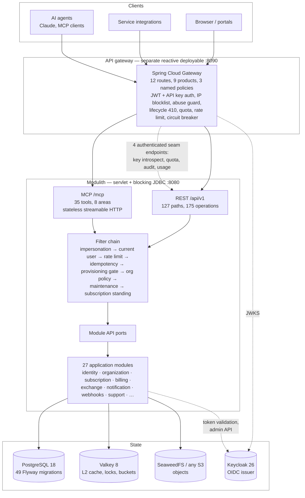

# enterprise-modulith-template

A template for building multi-tenant enterprise platforms on **Spring Boot 4.1 + Spring Modulith 2.1**
(Java 21, Postgres, Gradle Kotlin DSL). It is a modular monolith deliberately shaped so it can be split
into services later: 27 modules that own their data, talk through ports and events, and never reach into
each other's `internal` packages.

Three things make it unusual. **Module boundaries are enforced, not documented** — `ApplicationModules.verify()`
runs in the test suite, so an illegal dependency fails the build rather than a review. **The identity provider
is an adapter, not the model** — `person` is the canonical human and `external_identity` is the only table
permitted to store an identifier minted elsewhere, so adding Google, a SAML federation or a second Keycloak
realm is an `INSERT`, not a migration. **Every hard rule names the test that enforces it** — [AGENTS.md](AGENTS.md) §1
is 21 rules in a three-column table whose middle column is the test method that fails when you break it.

The system ships two protocol surfaces over the same module ports: a REST API behind a reactive
Spring Cloud Gateway, and an MCP server for AI agents.

---

## Architecture



MCP is a second protocol surface, not a second implementation: its 35 tool handlers call the same module
API ports the REST controllers call, and both are authorized by the same `ApiPermissionEvaluator`, so a
tool and its REST twin cannot disagree.

---

## The stack

Versions are pinned in [`gradle/libs.versions.toml`](gradle/libs.versions.toml); local service images in
[`docker/docker-compose.yml`](docker/docker-compose.yml).

| Concern | Choice | Version |
|---|---|---|
| Platform | Spring Boot, Spring Modulith, Java, Gradle (Kotlin DSL) | 4.1.0 / 2.1.0 / 21 / 9.6.1 |
| Edge | Spring Cloud Gateway (WebFlux), release train | 2025.1.2 |
| OLTP | PostgreSQL + Flyway | 18.4 |
| Cache / locks / buckets | Valkey (Redis-compatible) + Caffeine L1 | 8 |
| Object storage | SeaweedFS via AWS S3 v2 SDK — any S3-compatible store | 4.40 / SDK 2.49.3 |
| Analytics | DuckDB, embedded in-process OLAP | 1.5.5.0 |
| AuthN | Keycloak (OIDC), OAuth2 resource server | 26.7.0 |
| Agent protocol | MCP Java SDK (`mcp` bundle, Jackson 3) | 2.0.0 |
| Scheduling | ShedLock (JDBC provider) | 7.7.0 |
| Rate limiting | Bucket4j + Lettuce distributed proxy | 8.14.0 |
| Resilience | Resilience4j (`-spring-boot4` artifact) | 2.4.0 |
| Exchange codecs | commons-csv, Apache POI (SAX read / SXSSF write) | 1.14.1 / 5.4.1 |
| API docs | springdoc (`3.0.x` is the Boot 4 line) | 3.0.3 |
| Architecture tests | ArchUnit | 1.4.2 |
| Billing | Kill Bill + Kaui | 0.24.10 / 3.0.5 |
| Observability | Actuator + OpenTelemetry (OTLP) → `grafana/otel-lgtm` | 0.28.0 |

---

## Quickstart

Prerequisites: Docker with Compose, and any JDK — the build auto-provisions the Java 21 toolchain via foojay.
`make` with no target lists everything.

```bash
make env     # create docker/.env from the example — edit ports here if any clash
make pull    # pre-pull stack images (image-pull storms crash constrained Docker VMs)
make run     # start the app; Spring Boot Docker Compose support brings the whole stack up with it
```

That is the entire local environment in one command. In a second terminal, put the edge in front of it:

```bash
make gateway   # gateway on :8090, management/admin on :9090
```

| Then | Command / URL |
|---|---|
| Seed a demo org (`acme`, owner `paul`) + Kill Bill tenant | `make seed` |
| Get a dev access token | `make token` (or `make token U=<user>`) |
| Run the modulith suite (real Testcontainers) | `make test` |
| Run the gateway suite | `make gateway-test` |
| Regenerate OpenAPI + the Postman collection | `make openapi` |
| Recover from a bad local state | `make fresh` |
| Three replicas behind the edge, round-robin + kill a pod | `make multi-demo` |
| Health | <http://localhost:8080/actuator/health> |
| Keycloak | <http://localhost:8081> · Grafana <http://localhost:3000> |

Every infra coordinate is a `${ENV:default}`. If the whole stack clashes, `docker/.env.example` documents the
one-prefix convention (`28080`, `28090`, `25432`, …); [docs/LOCAL_ACCESS.md](docs/LOCAL_ACCESS.md) is the full
URL, credential and endpoint table.

### The Kubernetes path

Local only — a single-node k3s in a UTM VM, reached from the Mac. Four commands, then one `/etc/hosts` line:

```bash
make k3s-kubeconfig            # fetch + rewrite the VM kubeconfig
export KUBECONFIG=~/.kube/smsone-k3s.yaml
make k3s-images                # build arm64 images, stream them into the VM's containerd (no registry)
make k3s-up                    # state + dev Keycloak + the chart (idempotent)
make k3s-demo                  # roll, kill a pod, scale 3→5→3 under a live request loop
make k3s-argocd                # Argo CD — after this you deploy by committing
make k3s-jenkins               # self-hosted Jenkins controller
```

Operator guide: [`deploy/k3s-local/README.md`](deploy/k3s-local/README.md). Newcomer tour:
[docs/guides/k8s-local-walkthrough.html](docs/guides/k8s-local-walkthrough.html).

---

## The modules

Twenty-seven Java packages under `ug.co.smsone`, each with an `@ApplicationModule` `package-info.java` stating
what it is and what it deliberately is not. Public API at `<module>/`, everything else in `<module>/internal/`.

| Module | What it owns |
|---|---|
| `shared` | The kernel, and the only `Type.OPEN` module: envelope, errors, cursors, security, cache, idempotency, rate limiting, plus ports that default-deny when unimplemented. Never compile-depends on a business module. |
| `identity` | `person` (the canonical human), `external_identity`, `person_contact`, impersonation sessions, and the no-JIT provisioning gate. `PersonResolver` is the single seam where `(issuer, subject)` becomes a `person.id`. |
| `organization` | The tenant. `organization.id` IS the tenant key; 29 fixed permission codes bundled into DB-editable roles, with `OWNER` the only seeded code the application names. |
| `subscription` | The entitlement authority: plan catalog, trial and standing states, and the `Entitlements` port that member invite, webhook create and exchange submit all gate on. Depends on nothing but the kernel. |
| `billing` | Kill Bill integration keyed `externalKey = organization.id` — accounts, invoices, dunning, usage export. Gates nothing itself. |
| `payments` | Pesapal (hosted redirect: card + mobile money) and Yo! Uganda (direct mobile-money push). The gateway is the source of truth for an outcome, never the browser. |
| `apikeys` | Machine credentials — SHA-256 hashed, plaintext returned exactly once. An org key's permissions are a subset of what its creator held. |
| `access` | Post-authentication control beyond RBAC: self-registered devices the org (not the user) may mark trusted, and a per-org policy — IP allowlist, require trusted device, require MFA, session max age. Every field tightens, never loosens. |
| `audit` | Append-only `audit_log`, written synchronously inside the transaction that makes the change. No async, deliberately. |
| `compliance` | Consent history, legal holds, GDPR erasure. An active hold makes both the purge job and the erasure executor refuse to hard-delete. |
| `webhooks` | Per-org outbound subscriptions: HMAC-SHA256 signed, SSRF-guarded, retried with backoff, then dead-lettered. Secrets encrypted at rest. |
| `notification` | Dispatch does not send — it durably enqueues one row per recipient/channel and returns; a worker fans out. Email, in-app, webhook, Slack, SMS. |
| `exchange` | Import/export as durable, resumable, record-oriented jobs — CSV, JSONL, XLSX, XML. Domain-agnostic: business modules implement `ExchangeHandler`. At-least-once per record, so handlers must be idempotent. |
| `files` | Object storage behind `FileStorageProvider` (put, multipart, get, presign). No SDK type escapes the module. |
| `document` | The business record *of* a stored file, over storage keys `files` holds. Deletes asymmetrically: the object goes, the row soft-remains as the metadata trail. |
| `search` | Postgres FTS (`tsvector` + GIN) with a trigram fallback for prefixes and typos, over a module-local projection. No new engine, and no domain knowledge. |
| `analytics` | Embedded DuckDB OLAP behind an `AnalyticsEngine` port, so ClickHouse or Trino stay a pure implementation swap. Postgres remains the system of record. |
| `settings` | System settings plus feature flags with per-org overrides and targeting rules. The reference `@Cacheable` + event-publishing service. |
| `localization` | Translation catalog resolving exact tag → language → default locale → the key itself. A missing translation renders; it never throws. |
| `support` | Tickets and messages, per-priority SLA policies with per-org overrides, and an escalation job that flags, bumps priority, counts the breach and notifies. |
| `maintenance` | Scheduled windows. `ANNOUNCE` is banner metadata; `RESTRICT` makes org-scoped **writes** answer 503 + `Retry-After`. Reads always pass. |
| `scheduler` | The ShedLock JDBC infrastructure that makes a `@Scheduled` method fire once across all instances, plus the cross-cutting purge jobs and per-org retention overrides. |
| `integration` | Which external provider serves an org for a capability (SMS, email, payment gateway), at platform-default and org-override scope. Secret values AES-GCM encrypted at rest, masked on read. |
| `geo` | Coordinate capture attached to any record via the `GeoStamps` port, with a pluggable geocoder SPI. Bounding-box + Haversine over B-tree indexes, confined to persistence, so PostGIS later is a persistence-only change. |
| `profile` | A person's self-service display record: display name, timezone, locale, avatar, small preferences. Contacts are deliberately *not* here. |
| `signup` | Self-service org creation — the public front door, **off by default** (`SIGNUP_ENABLED`). A verified email runs the same provisioning path a platform admin uses. |
| `mcp` | The agent protocol surface. Owns no business capability, no tables, no events, no migrations — 35 tool handlers delegating to 13 module ports across 11 modules. |

---

## What is built in

Cross-cutting contracts every module inherits from `shared`. Each is pinned by a contract test, and the reasoning
behind the non-obvious ones lives in [docs/adr/](docs/adr/).

| Contract | The rule |
|---|---|
| **Response envelope** | Every JSON response is `data` XOR `errors`, always with `meta.requestId`. One shape for success and error. No stack trace, framework message or internal detail reaches the wire. |
| **Cursor pagination** | Collections take `page[size]` (max 100) and an opaque `page[after]` keyset cursor. There is no `page[number]`, no `totalPages`, and no `COUNT` query anywhere. ([ADR 0002](docs/adr/0002-cursor-pagination.md)) |
| **Idempotency** | `Idempotency-Key` on `POST`/`PUT`/`PATCH` under `/api/**` gives exactly-once semantics. The key is claimed *before* the handler runs, keyed on `(principal, key)`; a duplicate replays the stored response verbatim, a payload mismatch is 409. In-progress claims carry a 5-minute takeover lease so a crashed instance never wedges a key. ([ADR 0005](docs/adr/0005-idempotency-keys.md)) |
| **Two-level cache** | Caffeine L1 (short TTL, bounded) over Valkey L2, with cross-instance L1 invalidation on a pub/sub topic and a per-JVM id so nodes skip their own broadcasts. L2 failure degrades to L1-only; Lettuce timeouts pinned at 2s so a Valkey outage is a degrade, not a stall. ([ADR 0004](docs/adr/0004-two-level-cache.md)) |
| **Rate limiting** | Filter order 0, covering `/api/**` **and** `/mcp`. Tiers: writes 60/min and reads 600/min per tenant, MCP 300/min per key, default 300/min per principal. Scope degrades tenant → principal → IP; denials are 429 + `Retry-After` in the envelope. |
| **RBAC** | Two deliberately disjoint axes: three hierarchical platform realm roles, and 29 org permission codes. `ApiPermissionEvaluator` has **no role branch** — a platform tier grants zero org permission. Reaching tenant data as an operator is impersonation's job, which is audited and re-authorized on every request. |
| **Multi-tenancy** | `organization.id` is the tenant key everywhere. The token's `organization` claim is translated once at the edge; the provider's id never leaves `external_organization`. There are no cross-module foreign keys — cross-module links are soft refs. |
| **Soft delete** | Deletion writes `deleted_at`. Each entity declares its own `@SQLDelete` including `version = version + 1` (without it a concurrent flush silently resurrects the row) — an ArchUnit rule reads the annotation and fails the build otherwise. Unique constraints are partial indexes. |
| **Audit** | Modules record through one `AuditLog` port, synchronously and inside the changing transaction, so the row and the change commit together. Append-only: never soft-deletable, never mutated. Under impersonation the actor is the operator and the worn identity moves to `on_behalf_of`. |
| **Compliance / GDPR** | Consent history is append-only; a legal hold makes the shared `LegalHolds` port answer "held" and both the retention purge and the erasure executor refuse. Callers can export their own record. |
| **Observability** | `requestId`, `org_id` and `traceId` in the MDC on every log line; the same `X-Request-Id` rides in every error envelope, is the Loki log field, and is the trace correlation key. Metrics leave over OTLP; three provisioned Grafana dashboards, four alerts-as-code, and [one runbook per alert](docs/runbooks/). |

Request filter chain, in order: security (−100) → impersonation (−2) → current user & org MDC (−1) →
rate limit (0) → idempotency (1) → provisioning gate (2) → org security policy (3) → maintenance (4) →
subscription standing (5). The order is load-bearing and documented in the annotations.

---

## The two protocol surfaces

### API gateway

A separate reactive deployable — four Gradle subprojects (`core`, `security`, `platform-adapter`, `app`)
included from the root `settings.gradle.kts`, so it is one monorepo build but its own Spring Boot app,
boot jar and container image. It is separate because it is WebFlux end-to-end while the modulith is servlet
and blocking JDBC. Hexagonal per [ADR 0007](docs/adr/0007-api-gateway.md): `gateway:core` imports no platform
type, and `GatewayCoreArchitectureTest` fails the build if it starts.

- **12 routes / 9 products / 3 named policies / 1 backing service**, all config-as-data. Runtime-registered
  routes and manual blocklist entries persist in Valkey and re-apply on boot.
- **Global filter pipeline**: request id → trace context → access log → IP blocklist → abuse guard (20 denials
  in a minute → a 15-minute block, counted across replicas) → route lifecycle → auth (JWT via Keycloak JWKS,
  `X-Api-Key` via platform introspection, or an internal token) → usage metering → quota → plugin stage.
  Then load balancing, a Valkey token bucket, a circuit breaker, and a tenant-aware response cache.
- **Versioning is per route**: `PUBLISHED` → `DEPRECATED` (ships `Deprecation` and `Sunset`) → `RETIRED`
  (410 Gone), rebuilt on a refresh event, so retiring a version needs no restart.
- **Admin is unreachable from the edge** — route, catalog, OpenAPI, usage and blocklist endpoints bind to a
  separate management port (`:9090`), token-gated in production.
- It reaches the modulith over four authenticated seam endpoints: key introspection, quota, audit, usage.

### MCP agent surface

Stateless streamable HTTP at `/mcp` on the official MCP Java SDK 2.0 — plain JSON-RPC, no session id, no SSE,
which is what makes N replicas safe with no sticky routing.

| | |
|---|---|
| Tools | **35 across 8 areas** — webhook 8, exchange 7, organization 7, support 5, document 4, standing 2, foundation 1, search 1 |
| Safety kinds | 21 `READ`, 11 `WRITE`, 3 `DESTRUCTIVE`, rendered as the spec's `readOnlyHint` / `destructiveHint` / `idempotentHint` |
| Also served | 3 resources (two rendered from the enums on every read, so they cannot rot) and 2 prompts |
| Credentials | Exactly two: an org API key (`X-Api-Key` or `Authorization: Bearer sk_…`) and OAuth 2.1 for native connectors, with RFC 9728 discovery and an audience-pinned `mcp` scope |
| Authorization | The same `ApiPermissionEvaluator` the REST controllers use, asked twice — `tools/list` filters discovery, `tools/call` re-checks. A hidden tool is a courtesy; the re-check is the boundary. |

Tools are **org-implicit**: no tool takes an `orgId`, because the org comes from the authenticated credential.
The catalog is validated at boot — `<area>_<verb>` snake_case, unique names, a resolvable permission code — so a
malformed tool fails startup rather than a 4am agent call. `app.mcp.enabled=false` refuses every request with a
named JSON-RPC error rather than unregistering the servlet, because a 404 is indistinguishable from a typo.

Guide: [docs/guides/mcp-guide.html](docs/guides/mcp-guide.html) · [ADR 0009](docs/adr/0009-mcp-server.md).

---

## Running it for real

There is a working deployment loop, and it is honest about its scope.

| Piece | State |
|---|---|
| **Helm chart** (`deploy/helm/smsone`) | Four deployables + Keycloak in prod mode + a nightly `pg_dump` CronJob. State is external by rule — Postgres, Valkey, SeaweedFS and Kill Bill are endpoints the chart points at, never pods it runs. No credential appears in `values.yaml`; every credentialed env var reads from an operator-created Secret. |
| **Kubernetes** | **Local only, single-node**: k3s in a UTM VM on a Mac, arm64, plain HTTP, dev credentials, images side-loaded into containerd rather than pulled. `values-prod.yaml` and a prod Argo Application exist and are written to prod shape, but there is no in-repo evidence either has run on a real cluster. |
| **Zero-downtime** | One recorded local run of `make k3s-demo` — a rolling restart, a pod kill and a 3→5→3 scale under a live request loop through the edge — printed `RESULT total=699 ok=699 bad=0`. That is a recorded run of that script, not a benchmark or an SLO. It was recorded at 3 modulith replicas; `values-local.yaml` now defaults to 1, lowered to leave room for a build agent on an 8 GB VM. |
| **GitOps** | Argo CD watches this repo and reconciles the namespace with `prune` and `selfHeal` on, so a manual `kubectl edit` is reverted to what Git says. CI rewrites the single `imageTag:` line in the prod values file to the built commit SHA and pushes; the Application rolls it out. Pull-based, so there are no cluster credentials in CI. The loop that has actually run is the local one. |
| **CI — GitHub Actions** | The PR gate: modulith and gateway tests, both portals typechecked and built, CycloneDX SBOM + a Trivy scan blocking on CRITICAL, and `helm lint`. The image-publish and GitOps-bump jobs are **gated off by default** behind a repo variable — Jenkins does the CD. |
| **CI — self-hosted Jenkins** | Runs on the same k3s cluster, configured entirely from `jcasc.yaml` (no setup wizard; UI changes are overwritten on restart). Builds in an agent pod with a dind sidecar, publishes both images, then bumps the GitOps tag. **Its default `TEST_TASKS` is the gateway suite only** — the modulith's Testcontainers stack does not fit the VM's memory budget; the full suite runs on Actions, or on Jenkins with the parameter overridden on a bigger host. Neither system runs `:gateway:core:test`. |
| **Portals** | Two Next.js apps under `web/gateway/`, behind Keycloak login. Typechecked and built in CI, but **disabled in the local Kubernetes values** — they are not part of the local cluster loop. |
| **Load testing** | Committed k6 scenarios in `perf/` (baseline, spike, soak, edge enforcement, auth writes, gateway-vs-direct) with a live Grafana dashboard. Single-box runs are 429-capped by the platform's own rate limiting — that is enforcement working, so no throughput number from there is a benchmark. |

Failure modes worth knowing are written down rather than smoothed over — the self-triggering GitOps loop and the
two bad fixes for it, the build that took the whole single-node cluster down, and the Spring Boot cloud-platform
default that made `X-Forwarded-For` trusted in Kubernetes and nowhere else. See
[docs/runbooks/ci-jenkins.md](docs/runbooks/ci-jenkins.md) and
[docs/guides/cicd-gitops-and-cluster.html](docs/guides/cicd-gitops-and-cluster.html).

---

## Engineering standard

[**AGENTS.md**](AGENTS.md) is the repo's own standard — 736 lines, and not a style guide: every rule cites the
file that is its reference implementation, and the prime directive is *find the neighbouring file that already
solves your problem and match it*. §1 is 21 hard rules in a `Rule | Enforced by | Breaks as` table; §14 is a
43-item review checklist whose Documentation group is marked MUST, no exceptions.

- **Testcontainers only.** Every infra-touching test runs against real Postgres 18, Keycloak 26, SeaweedFS 4.40
  and Valkey 8. No H2, no embedded substitutes, no mocked repositories — only system-edge collaborators are
  mocked. ([ADR 0003](docs/adr/0003-testcontainers-only.md))
- **Structural tests.** `ModularityTests` runs `ApplicationModules.verify()` over all 27 modules.
  `ArchitectureTests` adds ArchUnit rules for field injection, generic exceptions, standard streams, and the
  soft-delete annotation contract. Contract tests pin the envelope, cursors, problem details, security,
  OpenAPI tags, multipart config and the Flyway baseline.
- **Test names are sentences stating the rule** — `aNonOwnerCannotSelfPromoteToOwner`,
  `crossOrgAccessIsDeniedBeforeAnyDbHit`. The negative is asserted too, proving a denial happened *before* the
  side effect. Every security rule and every fixed bug gets a test that fails without the fix.
- **Counted from source:** 583 test methods (483 modulith, 100 gateway) across 168 test files. That is a static
  count, not a green-run tally — run `make test` and `make gateway-test` for the truth.
- **No Lombok** (records + constructor injection), no field injection, no cross-module foreign keys, no JIT
  provisioning. ([ADR 0001](docs/adr/0001-platform-baseline.md))
- **49 Flyway migrations**, V1–V49, contiguous, creating 55 tables. Each carries its rationale in the file
  header — V10's runs 25 lines explaining, with three lettered reasons, why `app_user` was *split* rather than
  renamed. Vocabularies are documented `varchar`s, not Postgres enums, precisely so adding a value is an
  `INSERT` and not a migration.

Generated and committed: `docs/openapi/` (OpenAPI 3.0.1 — 127 paths, 175 operations, 49 schemas, 38 tags — plus a
Postman collection) via `./gradlew exportOpenApi`, and `docs/modulith/` (a C4 component diagram plus per-module
AsciiDoc and PlantUML for all 27) via `./gradlew exportModulithDocs`.

---

## Where to go next

| Document | What it is for |
|---|---|
| [docs/README.md](docs/README.md) | The documentation index — start here for anything not listed below |
| [AGENTS.md](AGENTS.md) | The engineering standard. Read §1 before writing code here |
| [docs/ARCHITECTURE.md](docs/ARCHITECTURE.md) | Module map, request path, cross-cutting contracts |
| [docs/LOCAL_ACCESS.md](docs/LOCAL_ACCESS.md) | Run it, get a token, drive every endpoint — Compose and k3s |
| [docs/SRS.md](docs/SRS.md) | Requirements with stable IDs, traced to the tests that verify them |
| [docs/DATA_MODEL.md](docs/DATA_MODEL.md) | Every table, column, index and invariant; lifecycle and retention |
| [docs/adr/](docs/adr/) | Nine decisions in a fixed voice: Context / Decision / Why / Consequences |
| [docs/guides/](docs/guides/) | Rendered explainers with diagrams — system, API, MCP, k8s walkthrough, CI/CD |
| [docs/runbooks/](docs/runbooks/) | One per provisioned alert, plus the restore drill and the Jenkins recovery |
| [docs/SLO.md](docs/SLO.md) | Four objectives with the exact measuring expression and the error budget |
| [docs/PRODUCTION.md](docs/PRODUCTION.md) | The road to a real cluster, and the dev-vs-prod knob table |
| [docs/PORTING.md](docs/PORTING.md) | Porting to another RDBMS: the five Postgres seams |
| [docs/CHECKLIST.md](docs/CHECKLIST.md) | Deliverables, ticked as their gates pass |
