# Architecture

Modular monolith on Spring Boot 4.1 + Spring Modulith 2.1. Twenty-seven modules, each a Java package
under `ug.co.smsone` declared with `@ApplicationModule`; boundaries are enforced on every build by
`ApplicationModules.verify()` and the generated diagrams below are refreshed on every build.

- **Generated Modulith docs** (C4 PlantUML + per-module canvases with events): [modulith/](modulith/) — regenerate with `./gradlew exportModulithDocs`
- **Tables and columns**: [DATA_MODEL.md](DATA_MODEL.md) — 54 tables, grouped by owning module
- **Event catalog**: [EVENTS.md](EVENTS.md)
- **Decisions**: [adr/](adr/)

## Module map

```mermaid
flowchart TB
    subgraph app["ug.co.smsone (single deployable)"]
        shared["shared (OPEN kernel)\nweb envelope · errors · security · impersonation filter\npersistence · cache · idempotency · rate limiting · events"]
        settings["settings\nkey/value config + feature flags"]
        localization["localization\ntranslation catalog · Messages port"]
        search["search\nPostgres FTS projection · SearchIndex port"]
        document["document\nmanaged-file catalog · Documents port"]
        exchange["exchange\nimport/export job platform · ExchangeHandler SPI"]
        subscription["subscription\nplan catalog · Entitlements gating port"]
        billing["billing\nKill Bill gateway · reconciles into subscription"]
        files["files\nFileStorageProvider → S3"]
        scheduler["scheduler\nShedLock cron jobs\n(+ soft-delete retention purge)"]
        analytics["analytics\nAnalyticsEngine → DuckDB"]
        notification["notification\npluggable channels · durable fan-out"]
        identity["identity\nperson = canonical identity · person_contact\nexternal_identity = provider links · no-JIT provisioning\nimpersonation sessions"]
        organization["organization\ntenant (organization.id) · RBAC authority\nexternal_organization = provider links"]
        audit["audit\nappend-only trail (AuditLog port)"]
        webhooks["webhooks\nper-org outbound subscriptions"]
        payments["payments\nPSP collections · Pesapal / Yo! adapters"]
        signup["signup\nself-service org creation (opt-in)"]
        geo["geo\ngeolocation stamps · GeoStamps port · Geocoder SPI"]
        mcp["mcp\nagent surface — MCP tools at /mcp over module ports"]
        profile["profile\nperson_profile · person_preference · avatars"]
        apikeys["apikeys\nsk_ machine credentials · ApiKeyAuthenticator port"]
        access["access\ndevices · per-org security policy filter"]
        integration["integration\nprovider configs · Integrations port"]
        compliance["compliance\nconsent · legal holds · erasure (LegalHolds port)"]
        maintenance["maintenance\nannounce / restrict windows via a filter"]
        support["support\ntickets · SLA policies · escalation"]
    end

    settings --> shared
    localization --> shared
    files --> shared
    scheduler --> shared
    analytics --> shared
    notification --> shared
    identity --> shared
    organization --> shared
    audit --> shared
    webhooks --> shared
    geo --> shared
    mcp --> shared
    profile --> shared
    apikeys --> shared
    access --> shared
    integration --> shared
    compliance --> shared
    maintenance --> shared
    support --> shared

    mcp --> organization
    mcp --> subscription
    mcp --> billing
    mcp --> webhooks
    mcp --> support
    mcp --> document
    mcp --> exchange
    mcp --> search
    mcp --> maintenance
    mcp --> access

    organization -- "PersonProvisioning · PersonDirectory\nProviderOrgMembership" --> identity
    notification --> identity
    profile --> identity
    profile --> files
    apikeys --> organization
    support --> notification
    search --> shared
    search --> identity
    search --> organization
    document --> shared
    document --> files
    document --> search
    exchange --> shared
    exchange --> files
    subscription --> shared
    billing --> shared
    billing --> subscription
    payments --> shared
    payments --> subscription
    payments -. "org's PAYMENT_GATEWAY choice" .-> billing
    signup --> shared
    signup -- "Organizations port" --> organization
    organization --> subscription
    webhooks --> subscription
    exchange --> subscription
    organization --> exchange
    exchange -. "artifacts via shared\nDocuments port" .-> document

    settings -. "FeatureFlagChanged\n(DB-backed event registry)" .-> notification
    organization -. "member / role / status events" .-> webhooks
    organization -. "OrganizationRegistered" .-> search
    identity -. "PersonProvisioned" .-> search

    identity -. "implements PersonLookup\n+ ImpersonationLookup" .-> shared
    organization -. "implements OrgLookup\n+ OrgAuthorization" .-> shared

    postgres[("PostgreSQL 18\nsystem of record")]
    valkey[("Valkey 8\nL2 cache + pub/sub")]
    seaweed[("SeaweedFS\nS3 objects")]
    keycloak["Keycloak 26\nOIDC issuer\n(one authentication adapter, not the directory)"]
    killbill["Kill Bill 0.24\nbilling system of record"]
    duckdb[("DuckDB\nembedded, in-process")]
    lgtm["grafana/otel-lgtm\nOTLP sink"]

    app --> postgres
    shared --> valkey
    files --> seaweed
    shared -- "validate the JWT (iss · aud · sig)" --> keycloak
    identity -- "Admin API: accounts, invites, realm roles,\norg membership (ProviderOrgMembership)" --> keycloak
    organization -- "Admin API: organizations" --> keycloak
    analytics --> duckdb
    analytics -- "materialize marts" --> postgres
    billing -- "REST + push notifications" --> killbill
    app -- "traces·metrics·logs" --> lgtm
```



## Identity resolution at the edge

**Provider identifiers die at the edge.** A validated token carries an issuer, a subject and — for
Keycloak — an alias-keyed `organization` claim. Those are one provider's names for a human and a
tenant, not this platform's. `CurrentUserProvider` translates them exactly once, in one class, and
hands every filter, controller and service downstream a `CurrentUser` stated in local vocabulary: a
`person.id`, an `organization.id`, the platform tier, and the permission set inside that tenant.

| Off the wire | Port (declared in `shared.security`) | Table that answers it | Becomes |
|---|---|---|---|
| `iss` + `sub` | `PersonLookup` | `external_identity` (`provider`, `issuer`, `external_subject`) | `CurrentUser.personId()` |
| `organization` claim (alias → `{id}`) | `OrgLookup` | `external_organization` (`provider`, `issuer`, `external_org_id` \| `external_alias`) | `CurrentUser.organizationId()` |
| — (derived from the two above) | `OrgAuthorization` | `membership` → `org_role` → `role_permission` | `CurrentUser.permissions()` |

Each port is resolved through an `ObjectProvider` and **each absence default-denies** — no person, no
tenant, no permissions — because `shared` must not compile-depend on the modules owning those tables
and an unanswerable question is not a yes. That inversion is the same seam as `AuditLog` and
`ImpersonationLookup`: interface in the kernel, implementation in the module that owns the rows.

**What the indirection bought.** `sub` used to *be* the identity and the Keycloak organization id used
to *be* the tenant key, so both escaped into every module, every column, the public API, Kill Bill and
the gateway. A second identity provider would have been a migration. It is now an insert into
`external_identity`: Keycloak is one row shape in that table, not the table's reason to exist, and no
module below the edge has an opinion about which provider signed the token. The `issuer` is taken from
the token rather than from configuration, and it is part of the uniqueness key — a staging realm and a
production realm both say `KEYCLOAK` over disjoint subject spaces.

**Both lookups sit behind the two-level cache** (`person-by-subject`, `org-by-external-id`; Caffeine
L1 + Valkey L2 — see Cross-cutting contracts below), so the steady-state cost of the translation is no
database read at all. It is safe to cache because the rows are immutable — `external_identity`'s
link columns are `updatable = false`, so a live link never re-points at a different person — and
because **it caches an identity, never a decision**: `ProvisioningGateFilter` still reads
`person.status` live on every request, so a disabled or erased account is refused on the very next
one and a stale entry can only fail closed. Absences are deliberately not cached, so a first-time
provisioning resolves on the person's next request with nothing to evict.

The cached value is the id **as text**, and that is not a style choice. L2 stores JSON, and a JSON
scalar cannot carry a type id the way an object can — a cached `UUID` reads back from Valkey as a
`String` and would `ClassCastException` inside the caching proxy on every authenticated request, but
only once L1 had expired, which is the worst shape a bug of this kind can have. The test
`ValkeyCacheIntegrationTest.aScalarLosesItsTypeAcrossL2WhichIsWhyTheEdgeResolversCacheText` pins it.

Resolution happens once per request, on the request thread, in `CurrentUserFilter` (`@Order(-1)`) —
not lazily. One of the callers is the JPA auditor, which runs inside a Hibernate flush, and issuing a
query from inside a flush yields an action-queue assertion rather than a saved row. Anything that
installs a `SecurityContext` on a thread of its own (`McpToolDispatcher` does) carries the same
obligation: resolve the caller there before opening a transaction.

## Request path (write with idempotency)

Filter order is load-bearing, not incidental — see AGENTS.md §5.5: `ImpersonationFilter` at
`@Order(-2)` swaps the principal **before** identity resolution and the org MDC (`-1`, so the
translation and every later log line and 429 carry the EFFECTIVE identity and tenant), rate limiting
(`0`), idempotency (`1`), the provisioning gate (`2`), org security policy (`3`), maintenance windows
(`4`) and subscription access (`5`) — one request, one effective identity, end to end.

```mermaid
sequenceDiagram
    participant C as Client
    participant RF as RequestIdFilter
    participant SEC as Security (JWT)
    participant IMP as ImpersonationFilter
    participant CU as CurrentUserFilter
    participant RL as RateLimitFilter
    participant IF as IdempotencyFilter
    participant PG as ProvisioningGateFilter
    participant CTRL as Controller
    participant DB as Postgres

    C->>RF: PUT /api/v1/... (Idempotency-Key, Bearer)
    RF->>SEC: requestId in MDC + response header
    SEC->>IMP: authenticated principal (iss, sub, org claim)
    IMP->>CU: effective principal (swapped iff X-Impersonate)
    CU->>DB: (iss,sub)→person.id · org claim→organization.id · permissions
    Note over CU,DB: two-level cache; a hit costs no connection
    CU->>RL: CurrentUser (personId, organizationId, roles, permissions)
    RL->>IF: within tenant/person/IP budget
    IF->>DB: claim (principal, key) [lease takeover]
    IF->>PG: cached-body request
    PG->>DB: person.status (live, never cached)
    PG->>CTRL: provisioned (authorize; peek under a session)
    CTRL->>DB: business tx (+ event registry row)
    CTRL-->>IF: envelope response
    IF->>DB: complete (status < 400) / release
    IF-->>C: envelope + X-Request-Id
```

Under an impersonation session every field of `CurrentUser` describes the **target** — that is what
makes tenant endpoints work inside a session — while `accountablePersonId()` names the operator.
Exactly one writer reads that accessor, `AuditLogImpl`, and it lands in `audit_log.actor_person_id`;
`created_by`, `updated_by`, the rate-limit bucket and the idempotency namespace all record the
identity the request ran as, so an impersonated write sits in the target's history exactly as their
own would.

## Cross-cutting contracts

| Contract | Where |
|---|---|
| Envelope (`data XOR errors`, `meta.requestId`) / RFC 9457 on request | `shared/web`, `shared/error` |
| Cursor pagination (`page[size]`/`page[after]`, no totals) | `shared/web` (`Cursors`, `WindowedResult`) |
| Identity resolution — `(iss, sub)` → `person.id`, org claim → `organization.id` | `shared/security` (`PersonLookup`, `OrgLookup`, `CurrentUserProvider`); `identity`, `organization` implement |
| Two-level cache (Caffeine L1 + Valkey L2, pub/sub invalidation) | `shared/cache` |
| Idempotency keys (per principal, claim + lease, replay) | `shared/idempotency` |
| Rate limiting (tiered token buckets keyed tenant → person → IP) | `shared/ratelimit` (Bucket4j + Valkey) |
| SSRF guard for caller-supplied outbound URLs | `shared/http` (`SafeOutboundUrl`) |
| Impersonation (`X-Impersonate`, principal swapped before every other filter) | `shared/security` filter + port, `identity` sessions |
| Soft delete + retention (`@SQLDelete`/`@SQLRestriction`, purge past `retention`) | `shared/persistence`, `scheduler` (`SoftDeletePurgeJob`) |
| Outbox = Modulith DB event registry; Inbox = `EventInbox` | `shared/events`, `event_publication` |
| Distributed locks for cron | `scheduler` (ShedLock JDBC) |
