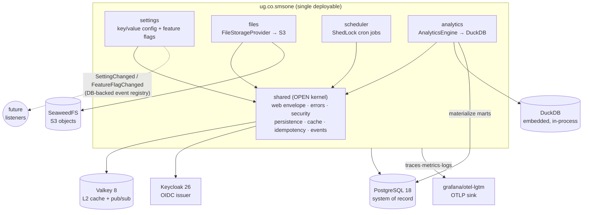
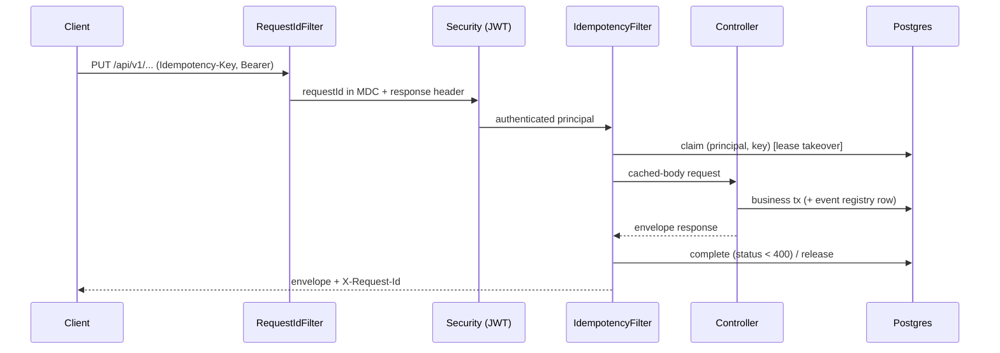

# Architecture

Modular monolith on Spring Boot 4.1 + Spring Modulith 2.1. Modules are Java packages under
`ug.co.smsone`; boundaries are enforced on every build by `ApplicationModules.verify()` and the
generated diagrams below are refreshed on every build.

- **Generated Modulith docs** (C4 PlantUML + per-module canvases with events): [modulith/](modulith/) — regenerate with `./gradlew exportModulithDocs`
- **Event catalog**: [EVENTS.md](EVENTS.md)
- **Decisions**: [adr/](adr/)

## Module map

## Request path (write with idempotency)

## Cross-cutting contracts

| Contract | Where |
|---|---|
| Envelope (`data XOR errors`, `meta.requestId`) / RFC 9457 on request | `shared/web`, `shared/error` |
| Cursor pagination (`page[size]`/`page[after]`, no totals) | `shared/web` (`Cursors`, `WindowedResult`) |
| Two-level cache (Caffeine L1 + Valkey L2, pub/sub invalidation) | `shared/cache` |
| Idempotency keys (per principal, claim + lease, replay) | `shared/idempotency` |
| Outbox = Modulith DB event registry; Inbox = `EventInbox` | `shared/events`, `event_publication` |
| Distributed locks for cron | `scheduler` (ShedLock JDBC) |
