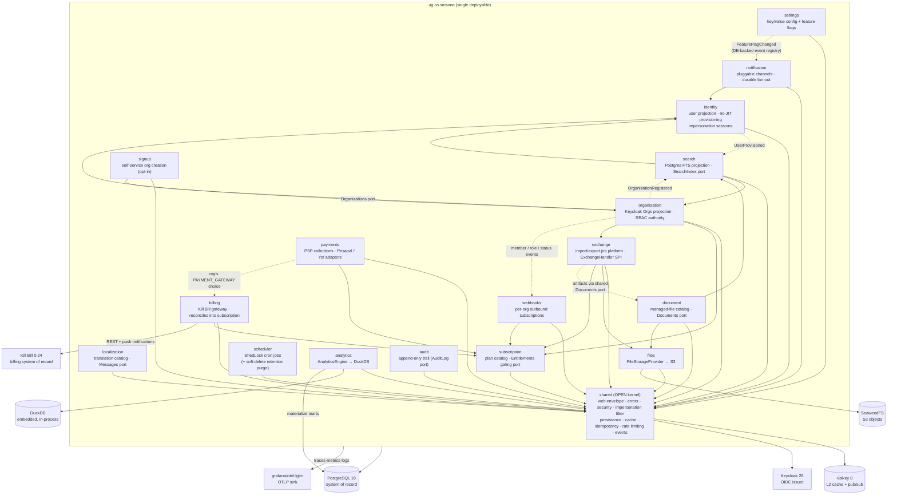

# Architecture

Modular monolith on Spring Boot 4.1 + Spring Modulith 2.1. Modules are Java packages under
`ug.co.smsone`; boundaries are enforced on every build by `ApplicationModules.verify()` and the
generated diagrams below are refreshed on every build.

- **Generated Modulith docs** (C4 PlantUML + per-module canvases with events): [modulith/](modulith/) — regenerate with `./gradlew exportModulithDocs`
- **Event catalog**: [EVENTS.md](EVENTS.md)
- **Decisions**: [adr/](adr/)

## Module map



## Request path (write with idempotency)

Filter order is load-bearing, not incidental — see AGENTS.md §5.5: `ImpersonationFilter` at
`@Order(-2)` swaps the principal **before** the org-MDC filter (`-1`, so every later log line and
429 carries the EFFECTIVE tenant), rate limiting (`0`), idempotency (`1`) and the provisioning
gate (`2`) — one request, one effective identity, end to end.

```mermaid
sequenceDiagram
    participant C as Client
    participant RF as RequestIdFilter
    participant SEC as Security (JWT)
    participant IMP as ImpersonationFilter
    participant RL as RateLimitFilter
    participant IF as IdempotencyFilter
    participant PG as ProvisioningGateFilter
    participant CTRL as Controller
    participant DB as Postgres

    C->>RF: PUT /api/v1/... (Idempotency-Key, Bearer)
    RF->>SEC: requestId in MDC + response header
    SEC->>IMP: authenticated principal
    IMP->>RL: effective principal (swapped iff X-Impersonate)
    RL->>IF: within tenant/subject/IP budget
    IF->>DB: claim (principal, key) [lease takeover]
    IF->>PG: cached-body request
    PG->>CTRL: provisioned (authorize; peek under a session)
    CTRL->>DB: business tx (+ event registry row)
    CTRL-->>IF: envelope response
    IF->>DB: complete (status < 400) / release
    IF-->>C: envelope + X-Request-Id
```

## Cross-cutting contracts

| Contract | Where |
|---|---|
| Envelope (`data XOR errors`, `meta.requestId`) / RFC 9457 on request | `shared/web`, `shared/error` |
| Cursor pagination (`page[size]`/`page[after]`, no totals) | `shared/web` (`Cursors`, `WindowedResult`) |
| Two-level cache (Caffeine L1 + Valkey L2, pub/sub invalidation) | `shared/cache` |
| Idempotency keys (per principal, claim + lease, replay) | `shared/idempotency` |
| Rate limiting (tiered token buckets keyed tenant → subject → IP) | `shared/ratelimit` (Bucket4j + Valkey) |
| SSRF guard for caller-supplied outbound URLs | `shared/http` (`SafeOutboundUrl`) |
| Impersonation (`X-Impersonate`, principal swapped before every other filter) | `shared/security` filter + port, `identity` sessions |
| Soft delete + retention (`@SQLDelete`/`@SQLRestriction`, purge past `retention`) | `shared/persistence`, `scheduler` (`SoftDeletePurgeJob`) |
| Outbox = Modulith DB event registry; Inbox = `EventInbox` | `shared/events`, `event_publication` |
| Distributed locks for cron | `scheduler` (ShedLock JDBC) |
