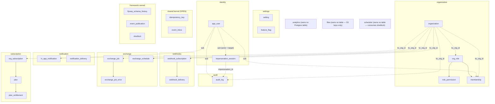
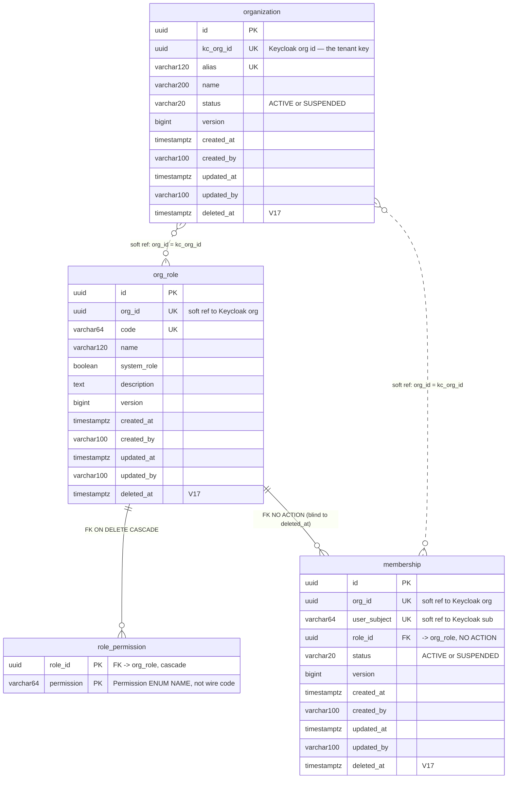
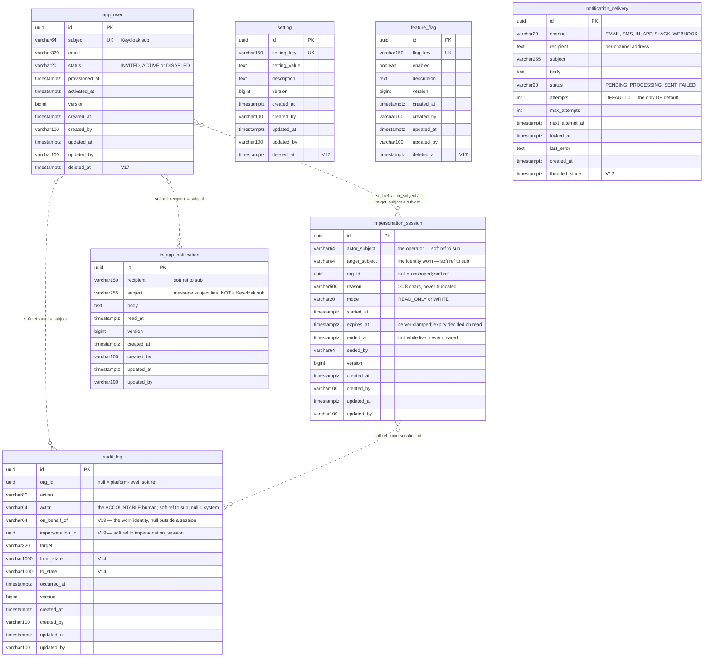
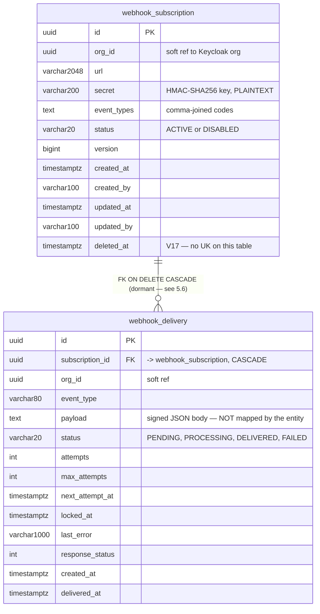
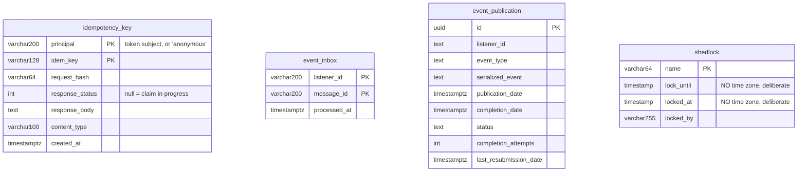

# Data Model

The authoritative reference for what is stored, where, and why. Every claim here was read out of
`src/main/resources/db/migration/*.sql` or the mapping/service that owns the table; paths are
repo-relative. Where the code and an older document disagree, **the code wins and this file follows
the code**.

Schema ownership: Flyway owns every table (`spring.jpa.hibernate.ddl-auto: validate`,
`src/main/resources/application.yaml:29`). No `spring.flyway.*` property is set anywhere in
`src/main/resources` or `src/test/resources`, so Boot's defaults apply — enabled, scanning
`classpath:db/migration`. There is no `schema.sql`, no test-only DDL, and no Hibernate-generated
schema in any profile. **V1..V26 exist; V20 is the 2026-08-01 audit's index remediation, V21
localization, V22 search, V23 document, V24 the exchange job queue, V25 the exchange
guideline completion (templates/schedules), V26 subscriptions, V27 billing, V28 profile, V29 api-keys, V30 groups, V31 devices, V32 security policies, V33 integration hub; the next free
number is V34.**

---

## 1. Overview — storage topology

Four stores, each with a distinct job. Only one of them is a system of record.

| Store | Role | What lives there | Why not Postgres |
|---|---|---|---|
| **PostgreSQL 18** | System of record | All 38 tables below: aggregates, work queues, the audit and impersonation trails, and the framework tables (Flyway history, the Modulith event registry, ShedLock) | — |
| **Valkey 8** | Cache L2 + rate-limit buckets + invalidation bus | Three named caches (`setting-values`, `feature-flags`, `org-permissions`) under key prefix `smsone:cache:`, Bucket4j token buckets under `<app.rate-limit.key-prefix>:<tier-id>:<tenant\|sub\|ip>:<value>`, and the `smsone:cache:invalidations` pub/sub topic | Derived, expendable data. Every value is recomputable from Postgres; an outage degrades to L1-only or fail-open, never to data loss (ADR 0004) |
| **SeaweedFS (S3 API)** | Object storage | Uploaded file bytes, keyed `u/<subject>/<uuid>/<sanitized-filename>` (`files/internal/FileController.newKey:132-136`) | **No database row describes an uploaded object.** The `files` module owns no table: the key encodes the owner, the object store is the index, and authorization is a namespace prefix check |
| **DuckDB (embedded)** | OLAP marts | `mart_users_by_status`, `mart_delivery_outcomes` in the DuckDB file at `app.analytics.database-path` (`data/analytics.duckdb`). Parquet export exists as an unwired seam only — see below | Postgres stays OLTP-only. Marts are point-in-time copies rebuilt from Postgres on each report run; the `AnalyticsEngine` seam keeps ClickHouse/Trino a pure implementation swap (ADR 0006) |

Three consequences worth stating plainly, because each has bitten:

- **DuckDB marts are copies, not views.** `AnalyticsReport.sourceSql` runs as raw JDBC against
  Postgres, so `@SQLRestriction` does not apply. A report over a soft-deletable table must filter
  `deleted_at is null` itself — `USERS_BY_STATUS` does exactly that
  (`analytics/internal/AnalyticsReport.java:22`) and the enum's javadoc enumerates the
  eighteen soft-deletable tables so the next report author does the same.
- **Valkey holds an authorization decision.** `org-permissions` caches the resolved permission set per
  `(orgId, subject)`. Organization status is evaluated *inside* the cached value
  (`organization/internal/PermissionResolver.java:34-41`) so a suspension plus its eviction takes
  effect immediately rather than at TTL.
- **No Parquet file is ever written by the running application.**
  `AnalyticsEngine.exportParquet(selectSql, fileName)` (`analytics/AnalyticsEngine.java:29`,
  implemented at `analytics/internal/DuckDbAnalyticsEngine.java:147`) is an **unwired seam**: it has
  **no caller anywhere in `src/main`**. The only report driver, `AnalyticsReportService.run`
  (`analytics/internal/AnalyticsReportService.java:22-25`), calls `materializeFromPostgres(..)` then
  `query(..)` and nothing else. The only callers of `exportParquet` are in
  `src/test/java/ug/co/smsone/analytics/AnalyticsIntegrationTest.java:62,133,135`. The configured
  `app.analytics.snapshot-dir` (`application.yaml:203`, default `data/snapshots`) is therefore **never
  populated at runtime** — the directory is not even created, since `Files.createDirectories` runs
  inside `exportParquet` itself (`DuckDbAnalyticsEngine.java:158`). This is the same shape as
  `WebhookDeliveryQueue.purgeDeliveredBefore` (§4.7.2): correct, tested, and dead in production.

---

## 2. Conventions

### 2.1 The entity hierarchy

`src/main/java/ug/co/smsone/shared/persistence/`. Three mapped superclasses, each adding exactly one
concern.

**`BaseEntity`** — `@MappedSuperclass @EntityListeners(AuditingEntityListener.class)`. Contributes six
columns to every entity that extends it:

| Field | Column | Mapping | Notes |
|---|---|---|---|
| `id` | `id` | `@Id @UuidGenerator @Column(nullable=false, updatable=false)` | `UUID`, generated application-side on persist. **No table has a DB-side id default** — no `gen_random_uuid()`, no `uuid-ossp` |
| `version` | `version` | `@Version @Column(nullable=false)` | `long` → `bigint not null`. Optimistic locking on every `BaseEntity` descendant |
| `createdAt` | `created_at` | `@CreatedDate @Column(nullable=false, updatable=false)` | `Instant` → `timestamptz not null` |
| `createdBy` | `created_by` | `@CreatedBy @Column(length=100, updatable=false)` | `varchar(100)`; nullable in DDL, never null in practice (§2.3) |
| `updatedAt` | `updated_at` | `@LastModifiedDate`, no explicit `@Column` | `timestamptz`, nullable |
| `updatedBy` | `updated_by` | `@LastModifiedBy @Column(length=100)` | `varchar(100)`, nullable |

Identity is id-based: `equals` requires the same concrete class *and* a non-null equal id;
`hashCode()` returns `Objects.hashCode(getClass())` — a constant per class, so an entity's hash is
stable across the pre-persist/post-persist transition (`BaseEntity.java:74-88`).

**`AggregateRoot extends BaseEntity`** — contributes **no columns**. Adds a `@Transient` event list,
`registerEvent(..)`, `@DomainEvents`, `@AfterDomainEventPublication`. Spring Data publishes registered
events on `repository.save(..)`.

**`SoftDeletableEntity extends AggregateRoot`** — contributes exactly one column: `deletedAt` →
`@Column(name="deleted_at")`, `Instant`, nullable. Plus `isDeleted()`, `getDeletedAt()`,
`markDeleted(when)` (throws `ConflictException` if already deleted) and `restore()` (throws if live).

**No class extends `AggregateRoot` directly.** The eleven `@Entity` classes:

| Entity | Table | Base class | Soft-deletable |
|---|---|---|---|
| `settings.internal.Setting` | `setting` | `SoftDeletableEntity` | yes |
| `settings.internal.FeatureFlag` | `feature_flag` | `SoftDeletableEntity` | yes |
| `localization.internal.Translation` | `translation` | `SoftDeletableEntity` | yes |
| `document.internal.Document` | `document` | `SoftDeletableEntity` | yes |
| `identity.internal.User` | `app_user` | `SoftDeletableEntity` | yes |
| `organization.internal.Organization` | `organization` | `SoftDeletableEntity` | yes |
| `organization.internal.Role` | `org_role` | `SoftDeletableEntity` | yes |
| `organization.internal.Membership` | `membership` | `SoftDeletableEntity` | yes |
| `webhooks.internal.WebhookSubscription` | `webhook_subscription` | `SoftDeletableEntity` | yes |
| `audit.internal.AuditEntry` | `audit_log` | `BaseEntity` | **no** — append-only by design |
| `identity.internal.ImpersonationSession` | `impersonation_session` | `BaseEntity` | **no** — an oversight record the overseen operator must not be able to erase (§4.3.2, §8) |
| `notification.internal.InAppNotification` | `in_app_notification` | `BaseEntity` | **no** — disposable, not an aggregate |
| `webhooks.internal.WebhookDelivery` | `webhook_delivery` | **none** — bare `@Entity`, own `@Id`, no `@Version` | no — read model over a JDBC-driven queue |

**Four** tables have no entity at all and are written with plain `JdbcTemplate`: `search_document`
(`search/internal/SearchIndexStore`), `idempotency_key`
(`shared/idempotency/IdempotencyStore`), `event_inbox` (`shared/events/EventInbox.java:29`) and
`notification_delivery` (`notification/internal/NotificationDeliveryQueue.java:39`). A fourth,
`webhook_delivery`, **has** an entity but only as a read model — its write side is plain
`JdbcTemplate` too (`WebhookDeliveryQueue`). Three more tables are framework-owned:
`flyway_schema_history`, `event_publication`, `shedlock`.

### 2.2 Soft delete contract (mechanism detail in §5)

Hibernate resolves neither `@SQLDelete` nor `@SQLRestriction` from a mapped superclass, so **all nine
concrete soft-deletable entities declare both themselves**, each naming its own table:

| Annotation | Contract it declares |
|---|---|
| `@SQLDelete` | the delete is `update <its table> set deleted_at = now(), version = version + 1 where id = ? and version = ?` — both halves of the version clause mandatory |
| `@SQLRestriction` | every HQL/criteria query is silently narrowed to `deleted_at is null` |

`src/test/java/ug/co/smsone/ArchitectureTests.java:45-80` pins this with an ArchUnit rule that
reconstructs the expected string from the entity's own `@Table` name and fails on any drift —
including a missing `version = version + 1`.

Both halves of the version clause are load-bearing. The `where version = ?` predicate makes a stale
delete affect zero rows and raise the usual concurrency failure. The `version = version + 1` increment
is the half that is easy to miss: a hard DELETE removes the row, so any instance loaded before it is
doomed to fail on its own flush — a soft delete leaves the row there. Without the bump a concurrent
flush still matches `version = ?`, and because that instance's in-memory `deletedAt` is null the
UPDATE writes `deleted_at = null` back. The deletion is silently undone and the caller sees a 200
(`SoftDeletableEntity.java:22-27`).

**There is deliberately no `deleted_by` column.** `@SQLDelete` runs as raw SQL and cannot see the
security context, so the column would be reliably populated only on the paths that bypass it — the
worst of both worlds. The actor lives in the `audit_log` row every deleting service writes
(`SoftDeletableEntity.java:28-31`).

### 2.3 Auditing columns — what actually lands in them

`shared/persistence/JpaAuditingConfig.java` wires both providers: the auditor is
`CurrentUserProvider.currentSubject()` with the `"system"` sentinel (`SYSTEM_AUDITOR`) as its
fallback, and the timestamp source is the injected `Clock`.

`created_by` / `updated_by` hold the **token subject** (`jwt.getSubject()`), never
`preferred_username`. `CurrentUserProvider.currentSubject()` (`shared/security/CurrentUserProvider.java:104-106`)
is the single source. Off-request — scheduled jobs, startup bootstrap, `ApplicationRunner`s — the
sentinel `"system"` is written, which is why the columns are nullable in DDL yet never null in
practice.

This is a durability property, not bookkeeping: `preferred_username` is mutable and, once freed,
reassignable, so a rename would silently re-point every historical row at whoever holds that name now.
Storing the subject also makes `created_by`/`updated_by` **join-compatible** with `audit_log.actor`
and `membership.user_subject`, which have always been subjects.

The same subject-keying is used for `audit_log.actor` (`audit/internal/AuditLogImpl.java:46-59`, but
`orElse(null)` → `Attribution.SYSTEM` rather than the sentinel — so a system-triggered audit row
carries a **null actor** while its `created_by` carries `"system"`), for `idempotency_key.principal`
(`shared/idempotency/IdempotencyFilter.java:164`, `orElse("anonymous")`), and for rate-limit bucket
keys (`shared/ratelimit/RateLimitKeyResolver.java:46`).

**One exception, and it is the only one in the schema.** Inside an impersonation session
`audit_log.actor` is *not* the effective subject: it is `CurrentUser.accountableSubject()`, the
operator, while `created_by`, `updated_by`, the idempotency principal and the rate-limit bucket all
keep recording the target. Those four describe what the account now looks like; `actor` describes who
made it look that way. §8 has the full rationale.

One value in the whole schema is neither a subject nor a sentinel: `V16__org_role_owner_only.sql:15`
stamps `updated_by = 'flyway:V16'` on the rows it flips.

### 2.4 Timestamp policy — three clocks, and they are not the same clock

| Column(s) | Written by | Source of "now" |
|---|---|---|
| `created_at`, `updated_at` on every `BaseEntity` | `AuditingEntityListener` | The **injected `Clock` bean** (`shared/config/ClockConfig`) via `auditingDateTimeProvider` |
| `audit_log.occurred_at` | `AuditLogImpl.record` | The injected `Clock` (`AuditLogImpl.java:33`) |
| `event_inbox.processed_at`, `idempotency_key.created_at` | `EventInbox`, `IdempotencyStore` | The injected `Clock` |
| `impersonation_session.started_at` / `expires_at` / `ended_at` | `ImpersonationService.open` / `.end` | The injected `Clock`. `ImpersonationLookupImpl` compares `expires_at` against that same `Clock` on every read, so both sides of the expiry decision share one time source |
| `deleted_at` via `repository.delete(..)` | `@SQLDelete` | **Postgres `now()`** — transaction start timestamp, DB server clock |
| `deleted_at` via `Role.softDelete(..)` | Ordinary dirty-check UPDATE | **JVM `Instant.now()`** (`RoleService.java:123`) — not the `Clock` bean |
| `notification_delivery` / `webhook_delivery` `created_at`, `next_attempt_at` at enqueue | JDBC queues | **Postgres `now()`** in the INSERT statement |
| `shedlock.lock_until`, `locked_at` | ShedLock | **Postgres** `timezone('utc', CURRENT_TIMESTAMP)` via `.usingDbTime()` |

The practical consequence: a test that fixes the `Clock` bean controls `created_at` and `occurred_at`,
but **cannot control `deleted_at` on any path**. Retention windows are therefore measured against wall
clocks that may differ by the app/DB skew — irrelevant at a P30D window, worth knowing at P0D.

All Postgres timestamp columns are `timestamptz` **except** `shedlock.lock_until` / `shedlock.locked_at`,
which are deliberately zoneless (§4.3).

### 2.5 Enum persistence

Every mapped enum is `@Enumerated(EnumType.STRING)` with an explicit `length`. No `ORDINAL` anywhere.

| Enum | Column | Length | Values |
|---|---|---|---|
| `identity.ProvisioningStatus` | `app_user.status` | 20 | `INVITED`, `ACTIVE`, `DISABLED` |
| `identity.internal.ImpersonationMode` | `impersonation_session.mode` | 20 | `READ_ONLY`, `WRITE` |
| `organization.internal.OrganizationStatus` | `organization.status` | 20 | `ACTIVE`, `SUSPENDED` |
| `organization.internal.MembershipStatus` | `membership.status` | 20 | `ACTIVE`, `SUSPENDED` — **`SUSPENDED` is unreachable**, see §4.4.4 |
| `webhooks.internal.SubscriptionStatus` | `webhook_subscription.status` | 20 | `ACTIVE`, `DISABLED` |
| `organization.Permission` | `role_permission.permission` | 64 | 15 values (§4.4) |

Enum-valued columns handled **outside** JPA are plain strings by convention, with **no CHECK
constraints** backing them: `notification_delivery.channel` / `.status`, `webhook_delivery.status`
(the read-model entity maps `status` as a `String`, not an enum). `NotificationDeliveryQueue.claim`
handles a `channel` value that no longer maps to the enum by dead-lettering that row in place rather
than throwing and poisoning every batch it lands in
(`notification/internal/NotificationDeliveryQueue.java:99-106`).

> **`role_permission` stores enum NAMES, not wire codes.** Because the mapping is
> `EnumType.STRING`, the stored value is `ORG_READ`, `MEMBER_INVITE`, … — *not* the `org:read` /
> `member:invite` codes that `Permission.code()` returns and that the REST API, the escalation guard
> and the audit trail all speak. Two vocabularies for the same concept; nothing in the column name or
> the migration signals which one is in the table.

### 2.6 Naming and defaults

- Tables and columns are `snake_case`. No naming-strategy override is configured, so Boot's
  `CamelCaseToUnderscoresNamingStrategy` derives any unnamed column (e.g. `readAt` → `read_at`).
- Two entities rename their field to dodge a reserved-ish word: `Setting.key` → `setting_key`,
  `Setting.value` → `setting_value`, `FeatureFlag.key` → `flag_key`.
- Indexes are `idx_<table>_<purpose>`; unique indexes are `uq_<table>_<cols>[_live]`; named
  constraints are `uq_<table>_<cols>`.
- **Exactly one column in the whole schema carries a DB `DEFAULT`**: `notification_delivery.attempts
  int not null default 0` (`V9:16`). Every other value — including `id` and `created_at` — is supplied
  by the application or written literally into the INSERT.

### 2.7 The no-cross-module-FK rule

Modules own their data; a foreign key across a module boundary would make one module's schema a
compile-time dependency of another's and would make extraction impossible. So **every foreign key in
this schema is intra-module**, and there are only three:

| FK | ON DELETE | Module |
|---|---|---|
| `role_permission.role_id → org_role(id)` | `CASCADE` (`V11:39`) | organization |
| `membership.role_id → org_role(id)` | none (`NO ACTION`) (`V11:49`) | organization |
| `webhook_delivery.subscription_id → webhook_subscription(id)` | `CASCADE` (`V15:22`) | webhooks |

Everything else that "points at" something is a **soft reference**: a bare column carrying an
identifier, with no constraint and no JPA association. There are no `@ManyToOne`, `@OneToMany` or
`@ManyToMany` mappings anywhere in the codebase — `membership.role_id` is a plain `UUID` field even
though a real FK exists in SQL. The one `@ElementCollection` is `role_permission`.

| Column(s) | Points at | Type |
|---|---|---|
| `organization.kc_org_id` | Keycloak organization | `uuid` |
| `org_role.org_id`, `membership.org_id`, `webhook_subscription.org_id`, `webhook_delivery.org_id`, `audit_log.org_id` | Keycloak organization id (also projected as `organization.kc_org_id`) | `uuid` |
| `app_user.subject` | Keycloak user `sub` | `varchar(64)` |
| `membership.user_subject` | Keycloak user `sub` (`app_user.subject` exists; there is intentionally no FK to it) | `varchar(64)` |
| `audit_log.actor` | Keycloak user `sub`, or null for system-triggered changes | `varchar(64)` |
| `audit_log.on_behalf_of` | Keycloak user `sub` — the identity worn inside an impersonation session; null otherwise | `varchar(64)` |
| `audit_log.impersonation_id` | `impersonation_session(id)` — **cross-module**, hence no FK | `uuid` |
| `impersonation_session.actor_subject`, `.target_subject` | Keycloak user `sub` (`app_user.subject` exists; no FK, so the row outlives the accounts it names — which is when the trail matters most) | `varchar(64)` |
| `impersonation_session.org_id` | Keycloak organization id; null when the session is unscoped | `uuid` |
| `audit_log.target` | free-form: subject, alias, role code, setting key | `varchar(320)` |
| `in_app_notification.recipient` | Keycloak user `sub` | `varchar(150)` |
| `notification_delivery.recipient` | email / phone / subject / URL, per channel | `text` |
| `idempotency_key.principal` | Keycloak user `sub`, or `"anonymous"` | `varchar(200)` |
| every `created_by` / `updated_by` | Keycloak user `sub`, or `"system"` | `varchar(100)` |

The purge job states the consequence explicitly: because those links are plain columns, "the database
imposes no order on them" during a hard delete (`scheduler/internal/SoftDeletePurgeJob.java:49-53`).

> **Read hazard.** `in_app_notification.subject` (`varchar(255)`, a *message subject line*) and
> `app_user.subject` / `membership.user_subject` / `audit_log.actor` (`varchar(64)`, a *Keycloak sub*)
> are unrelated concepts sharing the word "subject" across the schema. Check the length before writing
> a cross-table query.

---

## 3. Schema diagrams

### 3.1 Module map

Solid arrows are real foreign keys. Dotted arrows are soft references — no constraint, no JPA
association, resolved by id in application code.

### 3.2 Legend for the ER diagrams

| Notation | Meaning |
|---|---|
| `A ||--o{ B : "FK ..."` (solid) | A real SQL foreign key. The relationship label names the `ON DELETE` behaviour |
| `A }o..o{ B : "soft ref ..."` (dashed) | A soft reference: a bare column holding an identifier, **no constraint**, no cascade, no referential integrity. The database will happily let either side vanish |
| `PK` / `UK` | Primary key / unique. On soft-deletable tables every `UK` is a **partial** unique index `where deleted_at is null` (§5) |
| `FK` | Column participating in a real foreign key |

### 3.3 Organization module — the only module with real relationships

### 3.4 Identity, settings, audit, notification

No real foreign keys exist in any of these four modules. The last dashed line is the one that has to
stay dashed: `impersonation_session` belongs to `identity` and `audit_log` to `audit`, and this
project puts no foreign key across a module boundary — so the correlation survives either row being
purged, which is exactly the case a review needs it for.

### 3.5 Webhooks

### 3.6 Shared kernel and framework-owned tables

These four have no relationships to anything: each is a self-contained keyed store.

---

## 4. Per-module table reference

### 4.0 Framework-owned tables

#### 4.0.1 `flyway_schema_history`

Created by Flyway itself; appears in no migration and has no entity. Columns are Flyway's standard
layout. Read by `src/test/java/ug/co/smsone/shared/persistence/FlywayBaselineTest.java`, which asserts
at least one successful row exists — the smoke test that the migration chain actually ran.

**Lifecycle:** written by Flyway on every migration. Never touched by application code.

#### 4.0.2 `event_publication` — the outbox

`V2__modulith_event_publication.sql`, a verbatim copy of the
`spring-modulith-events-jdbc 2.1.0` `schema-postgresql.sql` v2 schema, wrapped in
`CREATE TABLE IF NOT EXISTS`.

| Column | Type | Null | Default | Notes |
|---|---|---|---|---|
| `id` | `UUID` | not null | — | **PK** |
| `listener_id` | `TEXT` | not null | — | The consuming listener, one row per (event, listener) |
| `event_type` | `TEXT` | not null | — | FQN of the event record |
| `serialized_event` | `TEXT` | not null | — | JSON payload |
| `publication_date` | `TIMESTAMP WITH TIME ZONE` | not null | — | |
| `completion_date` | `TIMESTAMP WITH TIME ZONE` | null | — | Null = incomplete; re-published on restart |
| `status` | `TEXT` | null | — | |
| `completion_attempts` | `INT` | null | — | |
| `last_resubmission_date` | `TIMESTAMP WITH TIME ZONE` | null | — | |

**Keys and indexes.** PK `(id)`. `event_publication_serialized_event_hash_idx` —
`USING hash(serialized_event)`, serving lookup/dedupe by payload.
`event_publication_by_completion_date_idx` on `(completion_date)`, serving the incomplete-publication
scan on restart and the nightly retention purge. No FKs.

**Invariants.** Rows exist **only for events that have a registered listener** — the registry persists
one row per (event, listener) pair. Four of the ten domain events (`SettingChanged`, `UserProvisioned`,
`UserActivated`, `OrganizationRegistered`) currently have zero production consumers and therefore
produce **no rows at all**. This is surprising enough that
`src/test/java/ug/co/smsone/scheduler/EventPurgeJobIntegrationTest.java:21` has to `@Import` its own
probe listener to make the purge observable.

**Lifecycle.** Written by `spring-modulith-events-jdbc` when an aggregate's registered events publish
on `save(..)`. Completed on successful listener execution.
`spring.modulith.events.republish-outstanding-events-on-restart: true`
(`application.yaml:53-55`) re-publishes incomplete rows on boot — this is what makes delivery
at-least-once. Purged by `scheduler/internal/EventPublicationPurgeJob` via
`CompletedEventPublications.deletePublicationsOlderThan(app.scheduler.event-retention)` (default
`P7D`, cron `0 0 3 * * *`) — **completed rows only**. An incomplete row (`completion_date is null`)
has no retention path at all and is re-published on every restart, so a permanently failing listener
accumulates rows *and* replays them indefinitely. See §7.3.

> V2's header comment asserts that `spring.modulith.events.jdbc.schema-initialization` "stays
> disabled". That property is **not actually set anywhere**; the code relies on the framework default.
> If that default ever flips, Flyway and the framework would both own this table's schema.

#### 4.0.3 `shedlock`

`V4__shedlock.sql`, the official ShedLock 7.x Postgres DDL.

| Column | Type | Null | Default | Notes |
|---|---|---|---|---|
| `name` | `VARCHAR(64)` | not null | — | **PK** — the `@SchedulerLock(name = ...)` value |
| `lock_until` | `TIMESTAMP` (no tz) | not null | — | Lock expiry |
| `locked_at` | `TIMESTAMP` (no tz) | not null | — | |
| `locked_by` | `VARCHAR(255)` | not null | — | Hostname of the holder |

**Why zoneless.** Deliberate, and the migration says so: `JdbcTemplateLockProvider.usingDbTime()`
writes `timezone('utc', CURRENT_TIMESTAMP)`, which yields *timestamp-without-time-zone* values.
`timestamptz` would break the lock comparisons. Provider wiring in
`scheduler/internal/SchedulingConfig`, with
`@EnableSchedulerLock(defaultLockAtMostFor = "PT10M", defaultLockAtLeastFor = "PT30S")`.

**Keys and indexes.** PK only. No FKs.

**Lifecycle.** Upserted by ShedLock on every scheduled-job tick; rows are never deleted (one row per
job name, reused). Read-only over HTTP at `GET /api/v1/scheduler/locks`
(`scheduler/internal/SchedulerController`, `hasRole('platform-support')`), which converts the zoneless
values back to UTC instants. There is deliberately no trigger endpoint — jobs are time-driven.

---

### 4.1 Shared kernel (module type `OPEN`)

#### 4.1.1 `idempotency_key`

`V5__idempotency_key.sql`. No entity; written with `JdbcTemplate` by `shared/idempotency/IdempotencyStore`.

| Column | Type | Null | Default | Notes |
|---|---|---|---|---|
| `principal` | `varchar(200)` | not null | — | **PK part 1.** The token **subject**, or `"anonymous"` |
| `idem_key` | `varchar(128)` | not null | — | **PK part 2.** The client's `Idempotency-Key` header, validated `^[A-Za-z0-9_-]{1,128}$` |
| `request_hash` | `varchar(64)` | not null | — | SHA-256 hex of `method \n requestURI \n body` |
| `response_status` | `int` | null | — | **Null = claim in progress.** Non-null = completed and replayable |
| `response_body` | `text` | null | — | Stored verbatim, replayed byte-for-byte |
| `content_type` | `varchar(100)` | null | — | Replayed as the stored `Content-Type` |
| `created_at` | `timestamptz` | not null | — | From the injected `Clock`; also the lease and retention clock |

**Keys and indexes.** Composite PK `(principal, idem_key)` and nothing else. The PK doubles as the
conflict target for the atomic claim: a single `insert … on conflict (principal, idem_key) do
update` statement that takes an existing row over only while that row is still an in-progress claim
(`response_status is null`) **and** older than the lease (`created_at < now − lease`) — see
`IdempotencyStore.claim`.

**Invariants.** Keys are scoped per principal — one user's key can never replay to, or block, another
user's request. That is a disclosure boundary, not tidiness (ADR 0005): a global namespace would let
one user replay another's stored response, bypassing `@PreAuthorize` entirely. Keying on the mutable
`preferred_username` would reopen it via username recycling, which is why `principal` is the subject.

An in-progress claim older than `app.idempotency.in-progress-lease` (default `PT5M`) is **taken over**
by the next caller, so a crashed instance never wedges a key until the purge job runs. Note the
consequence: takeover rewrites `request_hash`, so the "same key, different payload" 409 can only ever
fire against a **completed** row.

Only outcomes with `status < 400` are stored; 4xx/5xx release the key so errors stay retryable.

**There is an upper bound on what the table will ever hold, and it is a filter property, not a
column.** `app.idempotency.max-body-bytes` (default `262144` = 256 KiB, `IdempotencyFilter.java:54`)
bounds what the path will hash and store: the filter reads `maxBodyBytes + 1` bytes and, when the
body exceeds the limit, writes `ErrorCode.PAYLOAD_TOO_LARGE` and returns
(`IdempotencyFilter.java:79-85`) — **before** `store.claim(..)` at `:89`. So an oversized request
creates **no row at all**, is not replayable, and leaves the key free for a smaller retry. Like
`app.idempotency.in-progress-lease`, the key is absent from `application.yaml` and exists only as the
`@Value` default.

**Lifecycle.** Created and completed/released by `IdempotencyFilter` (`@Order(0)`, POST/PUT/PATCH
under `/api/` carrying the header — DELETE is excluded). Purged by
`scheduler/internal/IdempotencyPurgeJob` (`app.idempotency.retention`, default `P1D`, cron
`0 30 3 * * *`).

#### 4.1.2 `event_inbox`

`V7__event_inbox.sql`. No entity; `shared/events/EventInbox` over `JdbcTemplate`.

| Column | Type | Null | Default | Notes |
|---|---|---|---|---|
| `listener_id` | `varchar(200)` | not null | — | **PK part 1.** Two ids in use: `notification-flag-change`, `webhooks` |
| `message_id` | `varchar(200)` | not null | — | **PK part 2.** Derived from business identity, since domain events carry no envelope id |
| `processed_at` | `timestamptz` | not null | — | From the injected `Clock` |

**Keys and indexes.** Composite PK `(listener_id, message_id)` and nothing else. The PK *is* the
mechanism: `recordIfNew` does `insert ... on conflict do nothing` and returns `inserted == 1`, so
"true exactly once per (listener, message)" is a database guarantee, not application logic. The insert
joins the caller's transaction, so a listener that fails rolls its inbox record back too.

**Invariants.** One row per (listener, message) forever. `OrgPermissionCacheEvictor` deliberately uses
**no** inbox id — a cache clear is naturally idempotent, so guarding it would only add a write.

**Lifecycle.** Inserted by idempotent listeners before their side effects. **There is no purge job for
this table** — see §7.

---

### 4.2 Settings module

#### 4.2.1 `setting`

`V3__settings.sql`, amended by `V17`. Entity `settings.internal.Setting` (public class).

| Column | Type | Null | Default | Notes |
|---|---|---|---|---|
| `id` | `uuid` | not null | — | **PK** |
| `setting_key` | `varchar(150)` | not null | — | Field `key`; `updatable = false` — a key is never renamed, only created/deleted |
| `setting_value` | `text` | not null | — | Field `value`, `columnDefinition = "text"` |
| `description` | `text` | null | — | |
| `version` | `bigint` | not null | — | |
| `created_at` | `timestamptz` | not null | — | |
| `created_by` | `varchar(100)` | null | — | Subject or `"system"` |
| `updated_at` | `timestamptz` | null | — | |
| `updated_by` | `varchar(100)` | null | — | |
| `deleted_at` | `timestamptz` | null | — | Added `V17:23` |

**Keys and indexes.** PK `(id)`. The inline `unique` on `setting_key` (Postgres-named
`setting_setting_key_key`) is dropped in `V17:36` and replaced by the partial unique index
`uq_setting_key_live on setting (setting_key) where deleted_at is null` — so a deleted key is free to
recreate. Retention index `idx_setting_deleted on setting (deleted_at) where deleted_at is not null`
(`V17:67`). No FKs.

**Queries served.** `uq_setting_key_live` serves `SettingRepository.findByKey` (single-setting GET and
the upsert's existence check). The listing endpoint sorts `createdAt desc, id desc`
(`SettingService.java:34`) and is **not backed by a dedicated index** — acceptable at the cardinality
of a platform settings table, worth revisiting if it grows.

**Invariants.** At most one live row per `setting_key`. `setting_value` is never null (an empty value
is `""`, rejected upstream by `@NotBlank`).

**Lifecycle.** Created and updated by `SettingService.put(key, value, description)` — an upsert
reachable at `PUT /api/v1/settings/{key}` (`hasRole('platform-admin')`), which returns 200 even when it
creates. Soft-deleted by `SettingService.delete(key)` via `repository.delete(..)` → `@SQLDelete`
(Postgres `now()`). Both paths write an `audit_log` row (`settings.changed` / `settings.deleted`) and
`@CacheEvict` the `setting-values` cache — the delete method exists *because* of that eviction, since a
bare `repository.delete` would leave `valueOf(key)` serving the pre-delete value for the full
`app.cache.l2-ttl`. **`delete` is not exposed over HTTP**: `SettingController` declares no
`@DeleteMapping`, so a setting can only be removed from Java code.

#### 4.2.2 `feature_flag`

`V6__feature_flag.sql` + `V17`. Entity `settings.internal.FeatureFlag` (public class). Structurally
identical to `setting`.

| Column | Type | Null | Default | Notes |
|---|---|---|---|---|
| `id` | `uuid` | not null | — | **PK** |
| `flag_key` | `varchar(150)` | not null | — | Field `key`; `updatable = false` |
| `enabled` | `boolean` | not null | — | |
| `description` | `text` | null | — | |
| `version` | `bigint` | not null | — | |
| `created_at` | `timestamptz` | not null | — | |
| `created_by` | `varchar(100)` | null | — | |
| `updated_at` | `timestamptz` | null | — | |
| `updated_by` | `varchar(100)` | null | — | |
| `deleted_at` | `timestamptz` | null | — | Added `V17:24` |

**Keys and indexes.** PK `(id)`. Inline unique `feature_flag_flag_key_key` dropped `V17:40`, replaced
by `uq_feature_flag_key_live on feature_flag (flag_key) where deleted_at is null`. Retention index
`idx_feature_flag_deleted` (`V17:68`). No FKs. Same unindexed `createdAt desc, id desc` listing sort.

**Invariants.** At most one live row per `flag_key`. **An unknown flag is OFF, never an error**
(`FeatureFlagService.isEnabled` returns false for a missing key) — so deleting a flag is a valid way to
kill a feature, and the `@CacheEvict` on `delete` is what makes that kill switch take effect now rather
than in ten minutes.

**Lifecycle.** Upserted by `FeatureFlagService.set(...)` at `PUT /api/v1/feature-flags/{key}`
(`hasRole('platform-admin')`), returning 200 on create as well. Soft-deleted by
`FeatureFlagService.delete(key)` — again **not exposed over HTTP**. Both paths audit
(`settings.feature_flag_changed` / `settings.feature_flag_deleted`) and evict the `feature-flags`
cache. A toggle also publishes `FeatureFlagChanged`, the one event in the codebase that produces a
notification.

---

### 4.3 Identity module

#### 4.3.1 `app_user`

`V10__identity_user.sql` + `V17`. Entity `identity.internal.User`. A **local projection** of a Keycloak
account plus the provisioning lifecycle — Keycloak remains the identity system of record.

| Column | Type | Null | Default | Notes |
|---|---|---|---|---|
| `id` | `uuid` | not null | — | **PK** (local surrogate) |
| `subject` | `varchar(64)` | not null | — | Keycloak `sub`; `updatable = false`. **Soft ref, no FK** |
| `email` | `varchar(320)` | not null | — | RFC-max address length |
| `status` | `varchar(20)` | not null | — | `ProvisioningStatus` = `INVITED \| ACTIVE \| DISABLED` |
| `provisioned_at` | `timestamptz` | not null | — | `updatable = false` — when an admin created the row |
| `activated_at` | `timestamptz` | null | — | Set on the `INVITED → ACTIVE` transition |
| `version` | `bigint` | not null | — | |
| `created_at` | `timestamptz` | not null | — | |
| `created_by` | `varchar(100)` | null | — | |
| `updated_at` | `timestamptz` | null | — | |
| `updated_by` | `varchar(100)` | null | — | |
| `deleted_at` | `timestamptz` | null | — | Added `V17:25` |

**Keys and indexes.** PK `(id)`. Inline unique `app_user_subject_key` dropped `V17:44`, replaced by
`uq_app_user_subject_live (subject) where deleted_at is null` — this index serves
`findBySubject`, which runs on **every** request through the provisioning gate, so it is the hottest
index in the schema. `idx_app_user_email on app_user (email)` (`V10:17`). Retention index
`idx_app_user_deleted` (`V17:69`). No FKs.

> `idx_app_user_email` is on the raw column, but the only email query is
> `findFirstByEmailIgnoreCaseOrderByProvisionedAtAsc` (case-insensitive, used by
> `UserDirectoryService` to resolve an admin's subject for in-app notification). Postgres cannot use a
> plain btree index for a `lower(email)` match, so this index likely serves nothing the application
> actually runs. A functional index on `lower(email)` would.

**Invariants.** At most one **live** row per `subject`. `status` moves `INVITED → ACTIVE` exactly once
(`User.activate` is a no-op unless the current status is `INVITED`).

A deleted account and an account that never existed must not decide the same way at the gate, so
`UserRepository.existsDeletedBySubject` is a **native** query —
`select exists(select 1 from app_user where subject = :subject and deleted_at is not null)` — precisely
because `@SQLRestriction` makes the two indistinguishable to HQL.
`UserAccessService.absent(..)` uses it so a soft-deleted account resolves to `DISABLED` (a hard stop)
rather than `NOT_PROVISIONED` (the lenient branch that `GET /api/v1/me` lets through).

**Lifecycle.** Created as `INVITED` by `UserProvisioningService.saveLocalUser` after the Keycloak
account exists (admin-driven invite, or the opt-in dev bootstrap), publishing `UserProvisioned` and
auditing `identity.user_provisioned`. Flipped to `ACTIVE` on the first authenticated API call by
`UserAccessService.authorize`, publishing `UserActivated`.

Read over HTTP at **`GET /api/v1/admin/users`** (`identity/internal/UserAdminController.java:15,29-35`,
`hasRole('platform-support')` — read-only, so support is the floor). It is the **only** HTTP read path
over the whole table: cursor-paginated on `LIST_SORT = createdAt desc, id desc` (`:18`) with an
unfiltered specification (`cb.conjunction()`), exposing only `subject`, `email` and `status`. This is
the platform-wide list §8.1 records as having no supporting index — the sort is `(created_at desc,
id desc)` and `app_user` has no index on that pair.

> **No application code ever deletes an `app_user` row.** `User.disable()` exists but has no caller,
> and there is no disable or delete endpoint. The mapping is fully soft-delete-capable and the table is
> in `PURGE_ORDER`, but a row can currently only acquire `deleted_at` through direct SQL. The read side
> (`existsDeletedBySubject`, `absent`) is built for a write side that does not exist yet.

#### 4.3.2 `impersonation_session`

`V18__impersonation_session.sql`. Entity `identity.internal.ImpersonationSession` (`BaseEntity`).
One authorized episode of an operator acting as another user. Full rationale in §8; the columns:

| Column | Type | Null | Default | Notes |
|---|---|---|---|---|
| `id` | `uuid` | not null | — | **PK** |
| `actor_subject` | `varchar(64)` | not null | — | The operator — the human answerable. Soft ref, no FK |
| `target_subject` | `varchar(64)` | not null | — | The identity being worn. Soft ref, no FK |
| `org_id` | `uuid` | null | — | Tenant the session is scoped to; null when unscoped. Recorded, **not** validated against the target's memberships — permissions still resolve from the database, so a foreign org grants nothing |
| `reason` | `varchar(500)` | not null | — | Stated justification; ≥ 8 characters after trim, rejected (never truncated) beyond 500 |
| `mode` | `varchar(20)` | not null | — | `READ_ONLY` \| `WRITE`; `WRITE` needs `platform-admin` |
| `started_at` | `timestamptz` | not null | — | |
| `expires_at` | `timestamptz` | not null | — | Server-bounded TTL (default 15 min, cap 30). Expiry is evaluated **on read** |
| `ended_at` | `timestamptz` | null | — | Null while live; set on end/supersede, never cleared |
| `ended_by` | `varchar(64)` | null | — | The actor, or a platform admin |
| `version` / `created_at` / `created_by` / `updated_at` / `updated_by` | | | | `BaseEntity` |

**Keys and indexes.** PK `(id)`. `idx_impersonation_active (actor_subject, target_subject) where
ended_at is null` serves the one-live-session check on every open; `idx_impersonation_actor
(actor_subject, created_at desc, id desc)` matches the listing's keyset sort. No FKs, no unique
constraints — see §8 for why the active index is deliberately not unique and what serialises the pair
instead.

**No `deleted_at`, and no entry in `PURGE_ORDER`.** Sessions end; rows are never removed.

---

### 4.3a Organization user groups (`org_group`)

`V30__org_groups.sql`. `org_group` (soft-deletable, FIFTEENTH; purged FIRST in `PURGE_ORDER`,
before membership/org_role) confers one `role_id` to its members ON TOP of their direct membership
role — `PermissionResolver` UNIONS the direct role with every group role the subject is in, inside
the same cached value org status gates. A group extends a member, it is never an alternative way in
(adding a non-member 404s; a group role without an active membership grants nothing). Creating,
re-roling or staffing a group passes the escalation guard (a group can't confer more than its
creator holds), and every group mutation clears the `org-permissions` cache directly (there is no
group domain event — the effect must be immediate like a role change). `org_group_member` is an
`@ElementCollection` (cascade FK).

### 4.4 Organization module

`org_id` everywhere in this module is the **Keycloak organization UUID** — the tenant key — not
`organization.id`. The local surrogate PK is used only for row identity.

#### 4.4.1 `organization`

`V11__organization_rbac.sql:5-17` + `V17`. Entity `organization.internal.Organization`.

| Column | Type | Null | Default | Notes |
|---|---|---|---|---|
| `id` | `uuid` | not null | — | **PK** (local surrogate) |
| `kc_org_id` | `uuid` | not null | — | Keycloak organization id; `updatable = false`. **The tenant key used by every other table.** Soft ref, no FK |
| `alias` | `varchar(120)` | not null | — | Lowercase slug, normalized `trim().toLowerCase()` on create |
| `name` | `varchar(200)` | not null | — | |
| `status` | `varchar(20)` | not null | — | `OrganizationStatus` = `ACTIVE \| SUSPENDED` |
| `version` | `bigint` | not null | — | |
| `created_at` | `timestamptz` | not null | — | |
| `created_by` | `varchar(100)` | null | — | |
| `updated_at` | `timestamptz` | null | — | |
| `updated_by` | `varchar(100)` | null | — | |
| `deleted_at` | `timestamptz` | null | — | Added `V17:26` |

**Keys and indexes.** PK `(id)`. **Two** inline uniques dropped in `V17:48-49`
(`organization_kc_org_id_key`, `organization_alias_key`), replaced by
`uq_organization_kc_org_id_live (kc_org_id) where deleted_at is null` and
`uq_organization_alias_live (alias) where deleted_at is null`. This is the only table that needed two
partial unique indexes. Retention index `idx_organization_deleted` (`V17:70`). No FKs.

`uq_organization_kc_org_id_live` serves `findByKcOrgId`, which every org-scoped permission resolution
goes through; `uq_organization_alias_live` serves `findByAlias`/`existsByAlias`, the duplicate-alias
pre-check on create.

**Invariants.** At most one live row per `kc_org_id` and per `alias`. `status` is enforced *inside* the
cached permission set, so a suspension revokes every member's org permissions at once. Suspend and
reactivate are idempotent in the aggregate — already-suspended returns early rather than emitting a
spurious event and cache flush (`Organization.java:54-68`).

**Lifecycle.** Created by `OrgProjectionWriter.projectWithOwner` — the org row, its seeded system
roles, and the first OWNER membership commit in one transaction, and only after the Keycloak-side steps
succeed. `OrganizationService.create` refuses to adopt an existing alias (409 rather than a silent
adoption, because adoption would let the loser of a concurrent duplicate-alias race attach *its* owner
to the winner's org); only `ensureBootstrap` adopts. Renamed by `PATCH /api/v1/orgs/{orgId}`;
suspended/reactivated by the platform-admin endpoints. **No delete path exists** — same situation as
`app_user`.

#### 4.4.2 `org_role`

`V11:19-35`, amended by `V16` (data) and `V17` (soft delete). Entity `organization.internal.Role`.

| Column | Type | Null | Default | Notes |
|---|---|---|---|---|
| `id` | `uuid` | not null | — | **PK**; referenced by `role_permission` and `membership` |
| `org_id` | `uuid` | not null | — | Keycloak org id; `updatable = false`. **Soft ref, no FK** |
| `code` | `varchar(64)` | not null | — | `updatable = false` — an update cannot change the code |
| `name` | `varchar(120)` | not null | — | |
| `system_role` | `boolean` | not null | — | True ⇒ immutable and undeletable through the API |
| `description` | `text` | null | — | |
| `version` | `bigint` | not null | — | |
| `created_at` | `timestamptz` | not null | — | |
| `created_by` | `varchar(100)` | null | — | |
| `updated_at` | `timestamptz` | null | — | |
| `updated_by` | `varchar(100)` | null | — | |
| `deleted_at` | `timestamptz` | null | — | Added `V17:27` |

**Keys and indexes.** PK `(id)`. Named constraint `uq_org_role_org_code unique (org_id, code)` dropped
`V17:54`, replaced by `uq_org_role_org_code_live (org_id, code) where deleted_at is null` — V17's
header calls this the motivating case for the whole partial-index scheme: without it, "deleting the
role `AUDITOR` would permanently forbid ever creating another". `idx_org_role_org on org_role (org_id)`
(`V11:35`) serves `findByOrgId` (the role list). Retention index
`idx_org_role_deleted` (`V17:71`).

**Inbound FKs:** `role_permission.role_id` (CASCADE) and `membership.role_id` (NO ACTION). No outbound
FKs.

**Invariants.** At most one live role per `(org_id, code)`. **Only `OWNER` is seeded.**
`RoleSeeder.systemRoleDefinitions()` returns exactly one definition — `OWNER` with
`EnumSet.allOf(Permission.class)` — and `Role.OWNER_CODE` is the one code the application names.
Authorization never reads a role code; every request is decided on permissions. Two lifecycle rules
need a way to say "the owner": provisioning attaches the first one, and the last one cannot be removed
or demoted.

`V16` made this true for existing data by flipping `system_role` to false on pre-existing `ADMIN` and
`MEMBER` rows — **flipped, not deleted**, because `membership.role_id` references them and removing the
rows would orphan real members. Existing members keep exactly the permissions they had; the change is
who may *edit* the role, not what it grants. `ADMIN` and `MEMBER` are now ordinary custom codes an
owner may rename, re-permission or delete.

**Two pessimistic locks guard this table**, both added because soft delete removed the FK's veto (a
soft-deleted `org_role` row still satisfies `membership.role_id`):
`RoleRepository.lockByOrgIdAndCode` (`PESSIMISTIC_READ`, taken by writers about to *reference* a role
— invite and role assignment) and `RoleRepository.lockById` (`PESSIMISTIC_WRITE`, taken by
`RoleService.delete`). Without them a concurrent invite could slip a **live** membership onto a
**hidden** role, producing a member with no permissions and no error explaining why.

**Lifecycle.** Seeded per organization by `RoleSeeder.seedSystemRoles` (idempotent upsert; also
reconciles OWNER's permission set when the `Permission` enum gains a value, driven at startup for every
existing org by `SystemRoleCatalogReconciler`). Custom roles created/updated/deleted via
`/api/v1/orgs/{orgId}/roles` under `role:create` / `role:update` / `role:delete`, with the escalation
guard refusing to grant permissions the caller does not hold.

**Deletion is the one exception to the `@SQLDelete` path.** `RoleService.delete` (lines 104-126) takes
the exclusive lock, refuses system roles (403) and roles with live memberships (409), then calls
`role.softDelete(Instant.now())` + `roles.saveAndFlush(role)` — an ordinary versioned UPDATE.
`repository.delete(role)` is deliberately **not** used: `@SQLDelete` overrides only the entity row's
own delete statement, so Hibernate would still schedule the collection remove for `role_permission` and
hard-delete the permissions underneath the surviving row. The role would come back from
`SoftDeleteRecovery` granting nothing — "a restore that returns an empty authorization bundle looks
exactly like a restore that worked" (`Role.java:95-105`). `softDelete` also registers
`RolePermissionsChanged` explicitly, because a delete fires no `@DomainEvents` and the cached
permission sets must be evicted.

#### 4.4.3 `role_permission`

`V11:37-42`. No entity of its own — an `@ElementCollection` of `Role`.

| Column | Type | Null | Default | Notes |
|---|---|---|---|---|
| `role_id` | `uuid` | not null | — | **PK part 1**; `references org_role (id) ON DELETE CASCADE` |
| `permission` | `varchar(64)` | not null | — | **PK part 2**; the `Permission` **enum constant name** |

Mapping (`Role.java:53-57`): `@ElementCollection(fetch = FetchType.EAGER)` +
`@CollectionTable(name="role_permission", joinColumns=@JoinColumn(name="role_id"))` +
`@Column(name="permission", nullable=false, length=64)` + `@Enumerated(EnumType.STRING)` over a
`Set<Permission>` backed by `EnumSet`. Eager because a role is never useful without its grants — the
permission resolver loads a role solely to read them.

**Keys and indexes.** Composite PK `(role_id, permission)`, which also serves the "all permissions for
this role" lookup. No secondary indexes.

**Invariants.** The stored values are enum names (`ORG_READ`, `MEMBER_INVITE`, …), **not** the wire
codes (`org:read`, `member:invite`) — see §2.5. An unknown code on a role write is rejected upstream by
`Permission.isValid` with a 422; the column itself has no CHECK constraint, so a value written by hand
would fail at read time as an enum-mapping error, not at write time.

The catalog is 15 codes (`organization/Permission.java:13-30`): `org:read`, `org:update`, `org:delete`,
`org:settings:read`, `org:settings:update`, `member:read`, `member:invite`, `member:remove`,
`member:role:assign`, `role:read`, `role:create`, `role:update`, `role:delete`, `audit:read`,
`webhook:manage`. Three of them — `org:delete`, `org:settings:read`, `org:settings:update` — are
grantable (OWNER holds them via `EnumSet.allOf`) but **no endpoint checks them**; they are catalog
entries awaiting the endpoints they name.

**No `deleted_at`, deliberately** (`V17:7`): the collection's lifecycle follows `org_role`'s. It is
**not** in `PURGE_ORDER` either, because its FK cascades — Postgres removes these rows with the parent,
so an explicit purge step would be dead code (`SoftDeletePurgeJob.java:45-48`).

**Lifecycle.** Written entirely by Hibernate as part of saving a `Role`: `Role.create`,
`replacePermissions` (custom roles) and `reconcileSystemPermissions` (catalog drift on system roles).
Removed by cascade when a role is finally hard-deleted by the purge job.

#### 4.4.4 `membership`

`V11:44-60` + `V17`. Entity `organization.internal.Membership`.

| Column | Type | Null | Default | Notes |
|---|---|---|---|---|
| `id` | `uuid` | not null | — | **PK** |
| `org_id` | `uuid` | not null | — | Keycloak org id; `updatable = false`. **Soft ref, no FK** |
| `user_subject` | `varchar(64)` | not null | — | Keycloak `sub`; `updatable = false`. **Soft ref, no FK** — `app_user.subject` exists but is intentionally not referenced |
| `role_id` | `uuid` | not null | — | **Real FK** → `org_role (id)`, **no ON DELETE clause** (`NO ACTION`). Mapped as a plain `UUID`, not a `@ManyToOne` |
| `status` | `varchar(20)` | not null | — | `MembershipStatus` = `ACTIVE \| SUSPENDED` — but **only `ACTIVE` is ever written**, see below |
| `version` | `bigint` | not null | — | |
| `created_at` | `timestamptz` | not null | — | |
| `created_by` | `varchar(100)` | null | — | |
| `updated_at` | `timestamptz` | null | — | |
| `updated_by` | `varchar(100)` | null | — | |
| `deleted_at` | `timestamptz` | null | — | Added `V17:28` |

**Keys and indexes.** PK `(id)`. `uq_membership_org_user unique (org_id, user_subject)` dropped
`V17:58`, replaced by `uq_membership_org_user_live (org_id, user_subject) where deleted_at is null` —
the migration's stated rationale: "re-inviting someone previously removed must be possible". That index
serves `findByOrgIdAndUserSubject`, the lookup behind every org permission resolution.
`idx_membership_subject on membership (user_subject)` (`V11:59`).
`idx_membership_role on membership (role_id)` (`V11:60`) serves `existsByRoleId` (the role-deletability
check) and the pessimistic `lockByOrgIdAndRoleIdAndStatus`. Retention index `idx_membership_deleted`
(`V17:72`). The member listing sorts `createdAt desc, id desc` (`MemberService.java:39-40`) with no
supporting index.

**Invariants.** At most one **live** membership per `(org_id, user_subject)`. Exactly one role per
membership. **The last active OWNER cannot be removed or demoted**: `MemberService.guardLastOwnerLoss`
(lines 154-164) row-locks the active members holding the OWNER role with `PESSIMISTIC_WRITE` and
refuses with a 409 when the count is ≤ 1. The lock closes a real TOCTOU race — two concurrent removals
would otherwise both read `count == 2` and both commit, leaving zero owners and an unadministrable org.

`existsByRoleId` only sees **live** memberships (thanks to `@SQLRestriction`), which is what makes a
role whose last member was removed deletable at all — previously the FK made that impossible.

> **`MembershipStatus.SUSPENDED` is currently unreachable.** The only assignment to `status` anywhere
> is `membership.status = MembershipStatus.ACTIVE` in `Membership.create` (`Membership.java:45`); the
> aggregate declares no suspend or reactivate transition, and every other reference to the enum is a
> read (`PermissionResolver.java:43`, `MemberService.java:160`, `MembershipRepository.java:25`). So
> `membership.status` is `ACTIVE` for **every row a running system produces**. Suspension of a member
> is expressed today either by removing the membership (§ Lifecycle below) or by suspending the whole
> organization, which `PermissionResolver` evaluates inside the cached permission set (§4.4.1). This
> is the same shape as `User.disable()` in §4.3.1 — a modelled state with no write path — and unlike
> `OrganizationStatus.SUSPENDED`, which `Organization.suspend` does reach.

**Lifecycle.** Created by `MemberService.saveMembership` (invite; idempotent — re-inviting an existing
member returns the current row unchanged) and by `OrgProjectionWriter.projectWithOwner` (the first
OWNER). Role reassigned by `assignRole`, which no-ops early when the role is unchanged. Soft-deleted by
`MemberService.remove` via `memberships.delete(..)` → `@SQLDelete` (Postgres `now()`), inside an
explicit `TransactionTemplate` so the local delete commits **before** the Keycloak unlink — a remote
round-trip must never hold the pessimistic owner-row locks or a Hikari connection. A failed unlink is
logged at ERROR, not rethrown: access is already revoked because the membership row is gone. All three
paths audit and publish an event (`MemberRemoved` is published explicitly, since a delete fires no
`@DomainEvents`).

---

### 4.5 Notification module

#### 4.5.1 `in_app_notification`

`V8__notification.sql:20-35`. Entity `notification.internal.InAppNotification` (`BaseEntity`).
**Deliberately not soft-deletable** — `V17:5`: "BaseEntity, not an aggregate root; genuinely
disposable."

| Column | Type | Null | Default | Notes |
|---|---|---|---|---|
| `id` | `uuid` | not null | — | **PK** |
| `recipient` | `varchar(150)` | not null | — | The **Keycloak subject**. Soft ref, no FK |
| `subject` | `varchar(255)` | not null | — | The message **subject line** — unrelated to a JWT `sub` |
| `body` | `text` | null | — | |
| `read_at` | `timestamptz` | null | — | Field `readAt`, bare `@Column` → derived by the naming strategy. Null = unread |
| `version` | `bigint` | not null | — | |
| `created_at` | `timestamptz` | not null | — | |
| `created_by` | `varchar(100)` | null | — | |
| `updated_at` | `timestamptz` | null | — | |
| `updated_by` | `varchar(100)` | null | — | |

**Keys and indexes.** PK `(id)`. `idx_in_app_notification_recipient on in_app_notification (recipient,
created_at desc, id desc)` (`V8:35`) — a three-column composite that matches
`InAppNotificationService.LIST_SORT` (`createdAt desc, id desc`) exactly, so the keyset cursor scan is
index-only ordered per recipient. This is one of only three tables whose listing index matches its
cursor sort. No FKs.

**Invariants.** Rows are keyed by the **immutable Keycloak subject**, never a username: a mutable
`preferred_username` could be renamed and reassigned, handing the new holder the previous user's
notifications. `read_at` transitions null → non-null exactly once.

**Lifecycle.** Created by `InAppChannelSender` when the delivery worker processes an `IN_APP` delivery —
the address comes from `NotificationMessage.address()`, which the `Recipient.inApp(subject)` factory
documents as the Keycloak `sub`. Read at `GET /api/v1/notifications`, filtered to
`recipient = currentSubject()` (no `@PreAuthorize` — scoping *is* the authorization). Marked read by
`POST /api/v1/notifications/{id}/read`, which uses the conditional bulk update
`InAppNotificationRepository.markReadIfUnread` (`@Modifying(clearAutomatically = true)`) rather than
`save()` — chosen precisely so it does **not** bump `@Version`, turning two concurrent mark-reads from
an optimistic-lock 500 into a harmless no-op for the loser. **Rows are never deleted by any code path.**

#### 4.5.2 `notification_delivery`

`V9__notification_delivery.sql` + `V12`. No entity; `notification/internal/NotificationDeliveryQueue`
over `JdbcTemplate`. A work queue, not an aggregate — hence no `version`, no `created_by`/`updated_by`,
no `deleted_at`.

| Column | Type | Null | Default | Notes |
|---|---|---|---|---|
| `id` | `uuid` | not null | — | **PK**; `UUID.randomUUID()` in Java at enqueue |
| `channel` | `varchar(20)` | not null | — | `NotificationChannel` name string; no CHECK. An unparseable value is dead-lettered in place |
| `recipient` | `text` | not null | — | `text` not `varchar(320)` because Slack/webhook URLs exceed 320 |
| `subject` | `varchar(255)` | not null | — | Truncated to 255 at enqueue; a null subject becomes `""` since the column is NOT NULL |
| `body` | `text` | null | — | |
| `status` | `varchar(20)` | not null | — | `PENDING \| PROCESSING \| SENT \| FAILED` |
| `attempts` | `int` | not null | **`0`** | The only DB default in the schema |
| `max_attempts` | `int` | not null | — | Stamped from `app.notification.delivery.max-attempts` at enqueue |
| `next_attempt_at` | `timestamptz` | not null | — | `now()` at enqueue; backoff target on retry |
| `locked_at` | `timestamptz` | null | — | Set on claim, cleared on every terminal/retry update |
| `last_error` | `text` | null | — | Truncated to 1000 chars in Java |
| `created_at` | `timestamptz` | not null | — | Postgres `now()` at enqueue |
| `throttled_since` | `timestamptz` | null | — | Added `V12:5-6` |

**Keys and indexes.** PK `(id)`. One partial index:
`idx_notification_delivery_claim on notification_delivery (status, next_attempt_at) where status in
('PENDING','PROCESSING')` (`V9:25-27`) — serving the claim's inner
`select id ... order by next_attempt_at limit ? for update skip locked`. Partial so the index stays
tight as SENT rows pile up. No FKs.

> The partial predicate that keeps the claim index tight is also what leaves the **retention delete
> unindexed**. `purgeSentBefore` is `delete from notification_delivery where status = 'SENT' and
> created_at < ?` (`NotificationDeliveryQueue.java:141-143`) — `status = 'SENT'` is excluded from the
> only index on the table by construction, so the nightly-ish purge is a sequential scan over exactly
> the rows the table accumulates most of. See §8.1 for the fix shape.

**Invariants.** State machine `PENDING → PROCESSING → SENT | FAILED`, with `PROCESSING → PENDING` for
both retry and throttle-deferral. Every status update is **fenced** on
`status = 'PROCESSING' and attempts = ?` (the claimant's own count), so a slow worker whose claim went
stale and was re-claimed cannot corrupt the new owner's state — a zero-row update logs a warning and is
ignored.

`throttled_since` exists to measure **continuous** throttled time rather than age-since-enqueue: an old
message from a legitimate burst is not a mis-set-rate victim and must not be dead-lettered for having
waited its turn (`V12` header). `rescheduleThrottled` is the distinctive update — it sets
`attempts = greatest(attempts - 1, 0)`, undoing the claim's increment because throttling is not a failed
attempt, and `throttled_since = coalesce(throttled_since, now())`. `markSent` and `reschedule` clear it;
`deadLetter` does not.

**Lifecycle.** Enqueued in a single batch INSERT by `NotificationService.dispatch` — one row per
`(recipient, channel)`. Claimed, updated and dead-lettered by `NotificationDeliveryWorker` on a virtual
thread (`SmartLifecycle`, not `@Scheduled`, not ShedLock-guarded — `FOR UPDATE SKIP LOCKED` is what
makes N instances safe). **Retention lives in the worker, not the scheduler**:
`NotificationDeliveryWorker.maybePurge` (line 239) deletes `SENT` rows older than
`app.notification.delivery.retention` (P7D) at most once per `purge-interval` (PT1H), tracked by an
in-process timer.

Two consequences of siting retention there, both of which make rows immortal:

- **`SENT` is the whole predicate.** `purgeSentBefore` filters `status = 'SENT'`
  (`NotificationDeliveryQueue.java:141-143`), and it is the only statement in `src/main` that deletes
  from this table. `deadLetter` (`:134-139`) sets `status = 'FAILED'`, and **nothing ever removes a
  `FAILED` row** — a dead-lettered delivery is retained forever. The bounded part of the table is only
  the successful part. See §7.3 and §8.1.
- **The purge only runs while the poller runs.** `maybePurge()` is called from `runLoop()`
  (`NotificationDeliveryWorker.java:110`), and `runLoop` is started only under
  `if (config.workerAutoStart())` (`:67-68`). The public `drainOnce()` (`:127-146`) — what tests and
  any manual drain call — does **not** purge. So `app.notification.delivery.worker-auto-start: false`
  silently disables retention entirely, not just delivery. See §7.2.

---

### 4.6 Audit module

#### 4.6.1 `audit_log`

`V13__audit_log.sql` + `V14__audit_log_state.sql`. Entity `audit.internal.AuditEntry` (`BaseEntity`).
**Deliberately not soft-deletable** — `V17:4`: "append-only by definition; a deletable audit trail is
not an audit trail."

| Column | Type | Null | Default | Notes |
|---|---|---|---|---|
| `id` | `uuid` | not null | — | **PK** |
| `org_id` | `uuid` | null | — | Null for platform-level events (identity, settings). Soft ref, no FK |
| `action` | `varchar(80)` | not null | — | Dotted `module.verb_phrase`, e.g. `organization.member_added` |
| `actor` | `varchar(64)` | null | — | The **accountable human's** subject; **null for system-triggered changes**. Under impersonation this is the operator, not the request's effective subject — the one place in the schema where the two differ. Truncated to 64 |
| `target` | `varchar(320)` | null | — | The affected thing: subject, alias, role code, setting key. Truncated to 320 |
| `on_behalf_of` | `varchar(64)` | null | — | Added `V19`. Non-null **only** for a row written inside an impersonation session, and then the subject the actor was wearing. Indexed |
| `impersonation_id` | `uuid` | null | — | Added `V19`. The session carrying the stated reason. Soft ref to `impersonation_session`, no FK |
| `from_state` | `varchar(1000)` | null | — | Added `V14:4`. Truncated to 1000 |
| `to_state` | `varchar(1000)` | null | — | Added `V14:5` |
| `occurred_at` | `timestamptz` | not null | — | When the change happened (injected `Clock`) |
| `version` | `bigint` | not null | — | Inherited from `BaseEntity`; structurally meaningless here |
| `created_at` | `timestamptz` | not null | — | When it was **recorded** — the audit timeline, distinct from `occurred_at` |
| `created_by` | `varchar(100)` | null | — | Subject, or `"system"` |
| `updated_at` | `timestamptz` | null | — | Inherited; never written after insert |
| `updated_by` | `varchar(100)` | null | — | Inherited; never written after insert |

`V14:3` **drops** the `detail varchar(500)` column that `V13:11` created, superseded by the structured
before/after pair — turning the table into a full who/when/where/what/from→to record. The migration
notes there was no data to preserve.

**Keys and indexes.** PK `(id)`. Three indexes (`V13:21-23`):
`idx_audit_created (created_at desc, id desc)` for the global newest-first keyset scan;
`idx_audit_org_created (org_id, created_at desc, id desc)` for the per-org view; and
`idx_audit_action (action)` for the `action` equality filter. The first two match
`AuditController.NEWEST_FIRST` (`createdAt desc, id desc`) exactly. No FKs, no unique constraints.

> **`occurred_at` has no index, and it is the column the time filters use.** Both endpoints' `from`/`to`
> parameters compile to `greaterThanOrEqualTo(root.get("occurredAt"), from)` /
> `lessThan(root.get("occurredAt"), to)` (`AuditController.java:86-91`) — *not* `created_at`, which is
> what the keyset sort and both composite indexes are built on. A narrow window therefore filters on an
> unindexed column while scanning a `created_at`-ordered index. The two clocks are genuinely different
> (§2.4), so pointing the filters at `created_at` instead would change semantics, not just plans; the
> fix is an index. See §8.1.

**Invariants.** Append-only: **no code path anywhere updates or deletes an `AuditEntry`.** **Four** of
the five string fields are truncated at construction — `actor` to 64, `target` to `TARGET_MAX` 320,
`fromState` and `toState` to `STATE_MAX` 1000 (`AuditEntry.of`, lines 52-55, using the helper at
60-65) — so an over-long value degrades instead of throwing; an audit row must never be the thing that
fails a business transaction. `version`, `updated_at` and `updated_by` are inherited from `BaseEntity`
and are structurally meaningless for this table; they exist because the auditing base class is uniform.

> **`action` is the exception: it is assigned raw** (`AuditEntry.java:51`, a bare
> `entry.action = action;`), against a `varchar(80) not null` column (`V13:8`). An over-long action
> would fail the INSERT — and because `AuditLogImpl.record` (line 33) writes inside the caller's
> transaction, it would take the business transaction down with it, which is precisely the failure mode
> the other four truncations exist to prevent. It is safe today only because all 15 call sites pass
> compile-time string constants, the longest being `organization.member_role_changed` at 32 characters.
> A caller that ever computes an action would reintroduce the hazard.

**Lifecycle.** Written **synchronously** by `AuditLogImpl.record` through the shared `shared/audit/AuditLog`
port, called at the point of change *inside the changing transaction* — so the audit row commits or
rolls back atomically with the change, and the acting principal is still on the thread.

> The audit module consumes **no** domain events. `audit/internal` contains only `AuditController`,
> `AuditEntry`, `AuditEntryRepository` and `AuditLogImpl` — there is no `@ApplicationModuleListener`
> anywhere in it. `audit/package-info.java` and `docs/EVENTS.md:38` both state this correctly.

There are 22 call sites: `identity.user_provisioned` / `.user_disabled_by_reconciliation`; `organization.created` / `.renamed` / `.suspended` / `.reactivated` / `.member_added` / `.member_role_changed` / `.member_removed` / `.role_created` / `.role_updated` / `.role_deleted`; `platform.impersonation_started` / `._ended` / `._superseded`; `settings.changed` / `.deleted` / `.feature_flag_changed` / `.feature_flag_deleted`; `webhooks.subscription_created` / `.subscription_updated` / `.subscription_deleted`.

`identity.user_disabled_by_reconciliation` is the one action with a **null** actor by design — a
scheduled comparison made the decision, not a person; `created_by` still carries the `"system"`
sentinel. The three `platform.impersonation_*` actions are the only ones whose `actor` deliberately
differs from the request's effective subject (§8).

**Not audited today:** all file operations, and notification mark-read.

Read at `GET /api/v1/audit` (`hasRole('platform-support')`, optional `org`/`action`/`from`/`to`
filters) and `GET /api/v1/orgs/{orgId}/audit` (`audit:read`, org forced to the path, same
`action`/`from`/`to` filters). `org` and `action` are equality predicates on `org_id` and `action`;
`from`/`to` are a half-open `[from, to)` window over **`occurred_at`**. Rows are never purged — see §7.

---

### 4.7 Webhooks module

#### 4.7.1 `webhook_subscription`

`V15__webhooks.sql:2-17` + `V17`. Entity `webhooks.internal.WebhookSubscription`.

| Column | Type | Null | Default | Notes |
|---|---|---|---|---|
| `id` | `uuid` | not null | — | **PK**; referenced by `webhook_delivery` |
| `org_id` | `uuid` | not null | — | The owning tenant; `updatable = false`. Soft ref, no FK |
| `url` | `varchar(2048)` | not null | — | Caller-supplied target; SSRF-guarded at write **and** at send |
| `secret` | `varchar(200)` | not null | — | HMAC-SHA256 signing key, `"whsec_" + 24 random bytes hex` |
| `event_types` | `text` | not null | — | Comma-joined event codes; split/joined in the entity |
| `status` | `varchar(20)` | not null | — | `SubscriptionStatus` = `ACTIVE \| DISABLED` |
| `version` | `bigint` | not null | — | |
| `created_at` | `timestamptz` | not null | — | |
| `created_by` | `varchar(100)` | null | — | |
| `updated_at` | `timestamptz` | null | — | |
| `updated_by` | `varchar(100)` | null | — | |
| `deleted_at` | `timestamptz` | null | — | Added `V17:29` |

**Keys and indexes.** PK `(id)`. `idx_webhook_sub_org on webhook_subscription (org_id)` (`V15:17`) —
serves `findByOrgId` (the list endpoint) and `findByOrgIdAndStatus` (the fan-out query, run on every
org domain event). Retention index `idx_webhook_subscription_deleted` (`V17:73`).

> **This is the only soft-deletable table with no unique constraint of any kind.** `V15` declares none,
> so `V17` adds no partial unique index for it. There are now nine `deleted_at` columns and nine
> retention indexes (seven from `V17`; `translation` and `document` shipped with their own in `V21`
> and `V23`), and nine partial unique indexes: `V17` converted six tables' constraints —
> `organization` needing two — and `V21`/`V23` declare their tables' directly.

**Invariants.** `subscribesTo(code)` requires `status == ACTIVE` **and** membership in the parsed code
set, so a `DISABLED` subscription silently stops matching without losing its configuration. The valid
event vocabulary is five codes (`webhooks/internal/WebhookEventType`): `org.member.added`,
`org.member.removed`, `org.member.role_changed`, `org.role.permissions_changed`, `org.status_changed`.

The `secret` is stored **plaintext** — it must be replayable to sign each attempt, so it cannot be
hashed. It is returned in full **only** on create; every other read masks it to `whsec_••••••`. It is
never copied into a delivery row: `WebhookDeliveryQueue.claim` joins the subscription to return
`s.url, s.secret`, so the signature is computed at send time from the current secret and a rotation
takes effect on the next attempt.

**Lifecycle.** Created/updated/deleted through `/api/v1/orgs/{orgId}/webhooks` under `webhook:manage`.
Soft-deleted by `WebhookSubscriptionService.delete` via `subscriptions.delete(..)` → `@SQLDelete`, which
**in the same transaction** also calls `queue.cancelOutstanding(id, "subscription deleted")` — see
§5.6. No audit row is written for any of these.

Reading a deleted subscription's delivery log needs
`WebhookSubscriptionRepository.existsIncludingDeleted`, a **native** `select exists(...)` — native
because `@SQLRestriction` applies to every HQL query and would hide exactly the row this exists to find.
It deliberately returns a boolean rather than the entity: only the log read needs to see past the
delete, and handing out a deleted aggregate invites someone to mutate it. It is the one native reader
over a soft-deletable table that carries **no** `deleted_at` predicate — inventoried as such in §5.6.

#### 4.7.2 `webhook_delivery`

`V15:19-41`. Written with `JdbcTemplate` by `WebhookDeliveryQueue`; the `WebhookDelivery` entity is a
**read model only** (no base class, no `@Version`, never written through JPA). **Deliberately not
soft-deletable** — `V17:6`: "a log, not an aggregate; trimmed by retention, not by users."

| Column | Type | Null | Default | Mapped by entity? | Notes |
|---|---|---|---|---|---|
| `id` | `uuid` | not null | — | yes | **PK**; `UUID.randomUUID()` in Java |
| `subscription_id` | `uuid` | not null | — | yes (plain `UUID`) | **FK** → `webhook_subscription(id)` **ON DELETE CASCADE** |
| `org_id` | `uuid` | not null | — | yes | Soft ref |
| `event_type` | `varchar(80)` | not null | — | yes | The wire code, e.g. `org.member.added` |
| `payload` | `text` | not null | — | **no** | The exact signed JSON bytes. Unmapped on purpose: the log shows outcome, not the body |
| `status` | `varchar(20)` | not null | — | yes, as `String` | `PENDING \| PROCESSING \| DELIVERED \| FAILED` |
| `attempts` | `int` | not null | — | yes | No DB default — written literally as `0` at enqueue |
| `max_attempts` | `int` | not null | — | yes | |
| `next_attempt_at` | `timestamptz` | not null | — | **no** | |
| `locked_at` | `timestamptz` | null | — | **no** | |
| `last_error` | `varchar(1000)` | null | — | yes | Truncated to 1000 in Java |
| `response_status` | `int` | null | — | yes (`Integer`) | The endpoint's HTTP status |
| `created_at` | `timestamptz` | not null | — | yes | Postgres `now()` at enqueue |
| `delivered_at` | `timestamptz` | null | — | yes | Set on `DELIVERED` |

**Keys and indexes.** PK `(id)`. Three indexes (`V15:38-41`), two of them partial:
`idx_webhook_del_due on (next_attempt_at) where status = 'PENDING'` for the due-claim;
`idx_webhook_del_stale on (locked_at) where status = 'PROCESSING'` for the stale reclaim; and
`idx_webhook_del_sub on (subscription_id, created_at desc, id desc)` for the per-subscription
newest-first delivery log, matching `WebhookSubscriptionService.DELIVERY_SORT`.

**Invariants.** Same fenced state machine as `notification_delivery`: every terminal update requires
`status = 'PROCESSING' and attempts = ?`. `cancelOutstanding` is the one **unfenced** update — it is a
revocation, not a claimant update, and moves every `PENDING`/`PROCESSING` row for a subscription to
`FAILED` with the reason in `last_error`.

The payload is built by hand-rolled string concatenation (`WebhookPayload`) precisely so the exact bytes
that are signed are the exact bytes sent, with no dependency on mapper configuration.

**Lifecycle.** Enqueued in one batch INSERT by `WebhookDispatcher.dispatch`, once per matching active
subscription, guarded by `EventInbox`. Claimed and updated by `WebhookDeliveryWorker` on a virtual
thread. Rows survive their parent subscription's soft delete by design, so "what did we send that
endpoint?" is still answerable afterwards.

> **This table has no retention purge.** `WebhookDeliveryQueue.purgeDeliveredBefore(Instant)`
> (`webhooks/internal/WebhookDeliveryQueue.java:127`) exists and is correct, but **has no caller
> anywhere in `src/main` or `src/test`**, and there is no `app.webhooks.retention` property or scheduled
> job. `webhook_delivery` therefore grows without bound — contradicting both `V17:6` ("trimmed by
> retention") and `WebhookSubscriptionService.deliveries`' javadoc ("until retention purges it"). See §7.

---

### 4.8 Modules that own no Postgres table

| Module | Storage |
|---|---|
| **files** | SeaweedFS objects only. No table, no row describing an object; the key `u/<subject>/<uuid>/<name>` carries ownership, and `requireOwnerOr` is a string-prefix check plus a platform-role tier |
| **analytics** | DuckDB marts (`mart_users_by_status`, `mart_delivery_outcomes`) created inside the DuckDB file by `DuckDbAnalyticsEngine.materializeFromPostgres`. Marts are dropped and rebuilt via a `<mart>__staging` table swapped in atomically, so a failed refresh leaves the previous mart intact. **No Parquet file is written**: `AnalyticsEngine.exportParquet` (`AnalyticsEngine.java:29`, implemented `DuckDbAnalyticsEngine.java:147`) has **no caller in `src/main`** — the only report driver, `AnalyticsReportService.run` (`:22-25`), calls `materializeFromPostgres` + `query` — so `app.analytics.snapshot-dir` stays empty at runtime and the seam is exercised only by `AnalyticsIntegrationTest:62,133,135` (§1) |
| **scheduler** | Owns nothing; consumes `shedlock`, purges `event_publication`, `event_inbox`, `idempotency_key` and the soft-deleted rows of the nine aggregate tables |

---

### 4.9 Localization module

#### 4.9.1 `translation`

`V21__localization.sql`. Entity `localization.internal.Translation` (package-private, soft-deletable).

| Column | Type | Null | Notes |
|---|---|---|---|
| `locale` | `varchar(35)` | not null | **Lowercased** BCP-47 tag. Tags are case-insensitive (RFC 5646); one canonical casing keeps `(locale, msg_key)` unique in the table AND as the bundle-cache key |
| `msg_key` | `varchar(200)` | not null | Caller-owned message key — the module never decides which keys exist |
| `msg_value` | `text` | not null | The translated text; `{n}` `MessageFormat` placeholders |
| + base/soft-delete columns | | | `version`, audit stamps, `deleted_at` — the standard `SoftDeletableEntity` set |

**Keys and indexes.** Partial unique `(locale, msg_key) where deleted_at is null` (a soft-deleted
pair frees its slot); `idx_translation_locale` serves the whole-locale bundle load behind each cache
miss; `idx_translation_recent` the cursor listing; `idx_translation_deleted` the retention scan.

**Invariants.** Request-time resolution never touches this table: `TranslationBundles` caches one
map per locale (L1+L2, ADR 0004) and every write/delete evicts + broadcasts. The `Messages` port's
fallback chain is exact tag → language → `app.localization.default-locale` → the key itself — a
catalog gap renders, it never throws.

**Lifecycle.** Written by `TranslationService` under `platform-admin`, audited
(`localization.translation_changed` / `_deleted`, both with from→to). `TranslationChanged` publishes
via the aggregate on change and explicitly on delete. Purged last in `PURGE_ORDER` — nothing
references it.

### 4.10 Search module

#### 4.10.1 `search_document`

`V22__search.sql`. **No entity** — written and queried with plain JDBC (`SearchIndexStore`,
`SearchQueryService`), like the other hot projection paths.

| Column | Type | Null | Notes |
|---|---|---|---|
| `org_id` | `uuid` | null | Tenant key (soft ref). **Null = platform-wide**, reachable only via admin search |
| `entity_type` / `entity_id` | `varchar(40)` / `varchar(64)` | not null | The producer's vocabulary; unique together — the idempotent-upsert conflict target |
| `title` / `body` | `varchar(300)` / `text` | not null | What gets indexed |
| `tsv` | `tsvector` | generated | `to_tsvector('simple', title ‖ body)` — GENERATED, so no producer can write a vector that disagrees with the text |
| `updated_at` | `timestamptz` | not null | From the injected `Clock` |

**Keys and indexes.** `uq_search_entity (entity_type, entity_id)`; `GIN (tsv)` — the match;
`GIN (title gin_trgm_ops)` — the prefix/typo fallback (`word_similarity`); btree `(org_id)` — the
tenant cut. **Not soft-deletable, deliberately**: a projection is rebuildable from its producers,
so deletion here is un-indexing, not the loss of a record.

**Invariants.** Ranks travel through cursors as `float8` — both rank functions return `float4`,
whose shortest text form parses into a *different* double on the JDBC side, and an uncast rank
would make keyset page 2 repeat page 1 (`SearchQueryService` casts once and says why). Tenant
search always filters `org_id` inside the query (§5.6-style); the trigram fallback runs only when
the tsquery matched nothing, and the cursor carries the chosen mode so later pages never re-decide.

**Lifecycle.** Fed by the `SearchIndex` port and by the module's own idempotent listeners
(`OrganizationRegistered`, `UserProvisioned` — inbox-guarded, upsert-deduped). Removed by producers
via the port. Grows with the entities its producers index — rebuildable, so retention is the
producers' concern, not a purge job's.

### 4.11 Document module

#### 4.11.1 `document`

`V23__document.sql`. Entity `document.internal.Document` (package-private, soft-deletable,
immutable after registration except through deletion).

| Column | Type | Null | Notes |
|---|---|---|---|
| `org_id` | `uuid` | null | Null = personal document (owner-scoped, files-style platform tiering) |
| `owner_subject` | `varchar(64)` | not null | Token subject, never a username |
| `storage_key` | `varchar(300)` | not null | Soft ref into the files namespace (`doc/o/<org>/…` or `doc/u//…`); bytes live behind `FileStorageProvider` |
| `name` / `content_type` / `size_bytes` / `source` | | not null | `source` is `UPLOAD` or `EXCHANGE` — who filed it |
| + base/soft-delete columns | | | the standard `SoftDeletableEntity` set |

**Keys and indexes.** Partial unique on `storage_key` (a deleted row frees the key — the object is
gone anyway); org and personal listing keyset indexes; the retention scan partial.

**Invariants.** Deletion is asymmetric BY DESIGN and the migration header states it: the OBJECT is
removed first (remote, outside the transaction, §4.3's rule), then the row soft-deletes with its
audit row in one transaction — a restore recovers the record of the document, never its content. A
crash between the two leaves a row whose download 404s and whose retried delete finishes the job.
Titles are pushed into `search_document` on register and removed on delete (the reference producer
for the `SearchIndex` port). `DocumentRegistered` is published EXPLICITLY after save — the id is
persist-assigned, so an aggregate-registered event could not carry it.

**Lifecycle.** Registered via upload (`/documents` surfaces) or the `Documents` port (`EXCHANGE`
artifacts); audited `document.registered` / `document.deleted`. Purged last in `PURGE_ORDER`.

### 4.12 Exchange module

#### 4.12.1 `exchange_job`

`V24__exchange.sql`. **No entity — plain `JdbcTemplate`** (`exchange.internal.ExchangeJobStore`),
the §4.4 queue rule: this is the webhook/notification queue species, not an aggregate. NOT
soft-deletable — a job row is a work record, like `webhook_delivery`.

| Column | Type | Null | Notes |
|---|---|---|---|
| `org_id` | `uuid` | not null | Soft ref (no FK — module boundary) |
| `requester` | `varchar(64)` | not null | Token subject captured at submit; per-record authorization re-resolves THIS subject's permissions at processing time |
| `job_type` / `handler` / `format` | | not null | `IMPORT`/`EXPORT`; `ExchangeHandler.id()`; `CSV`/`JSONL` |
| `status` | `varchar(30)` | not null | `PENDING → VALIDATING → PROCESSING → COMPLETED / COMPLETED_WITH_ERRORS / FAILED / CANCELLED` (the guidelines' lifecycle) |
| `source_key` / `result_key` / `error_report_key` | `varchar(300)` | null | Files-port keys (`exch/o/<org>/…`); every one is also registered as an `EXCHANGE` document |
| `processed` / `failed` | `bigint` | not null | Progress counters, committed per batch |
| `next_offset` | `bigint` | not null | **The resume point**: data-record ordinal the next attempt starts from — a reclaimed job continues, never restarts |
| `attempts` | `int` | not null | Claim generations (incremented per claim); EVERY later write is fenced on it |
| `cancel_requested` | `boolean` | not null | Read back by the per-batch progress write — cancellation lands at batch boundaries |
| `locked_at` | `timestamptz` | null | Claim lock AND heartbeat: re-stamped by every progress write, so only a crashed claimant goes stale |
| `last_error` | `text` | null | Tenant-visible, curated — real exceptions go to the log only |

**Keys and indexes.** Partial claim index over non-terminal statuses ordered `created_at`; org
listing keyset index; partial terminal index for a future retention job.

**Invariants.** Claim is `FOR UPDATE SKIP LOCKED`, one job per claim (jobs are internally batched
marathons; fan-out is instances sharing the queue, not threads inside one). Progress commits
counters + offset + the batch's error rows in ONE transaction. Handlers see at-least-once delivery
of the uncommitted batch and are idempotent by contract (`ExchangeHandler` javadoc).

#### 4.12.2 `exchange_schedule`

`V25__exchange_platform_completion.sql`. Entity `exchange.internal.ExchangeSchedule`
(soft-deletable — user-managed configuration, the `webhook_subscription` species; tenth in
`PURGE_ORDER`). A recurring EXPORT: six-field Spring cron evaluated in UTC, fired by
`ExchangeScheduleFiringJob` (every minute, ShedLock `exchange-schedule-fire`, due rows row-locked
with SKIP LOCKED). Fires AS the schedule's `requester`, whose export permission is re-resolved at
every fire — a revocation DISABLES the schedule loudly rather than letting it keep exporting.
Imports cannot recur (no source to re-read); `V25` also stamps `handler_version` onto jobs (which
template shape a job was submitted against) and tightens `exchange_job.org_id` to NOT NULL — the
V24 "platform-scoped" relaxation had no submitter and a null would have NPE'd the worker.

#### 4.12.3 `exchange_job_error`

`V24__exchange.sql`, cascade FK to `exchange_job` — same-module FK, allowed. Row errors are
DURABLE, not worker memory: they commit with the batch that found them, so the finalize step
streams the COMPLETE row-addressed report even across crashes, and the `(job_id, row_num)` PK plus
`on conflict do nothing` makes replayed batches rewrite nothing. `row_num` is the 1-based data
record ordinal (header excluded). `error` is the curated `InvalidRecordException` message.

### 4.13 Subscription module

`V26__subscription.sql`. The commercial axis of a tenant, orthogonal to lifecycle status.

**`plan` + `plan_entitlement`** — seeded vocabulary (`PlanSeeder`: FREE/PRO/ENTERPRISE,
create-if-absent), NOT soft-deletable. `plan_entitlement` is an `@ElementCollection` map
(`role_permission`'s species; cascade FK): key present with `limit_value = -1` = feature ON
(a NEGATIVE sentinel, because Hibernate drops null-valued map entries on load), positive value =
numeric cap, absent key = feature-off / unlimited — so ENTERPRISE carries no limit rows.

**`org_subscription`** — one live row per org (partial unique on `org_id`), soft-deletable
(eleventh in `PURGE_ORDER`); `plan_id` FK intra-module; status `ACTIVE|TRIALING|PAST_DUE|CANCELLED`;
no row at all = the seeded FREE plan. Assigning a plan is a platform act
(`PUT /api/v1/admin/orgs/{id}/subscription`), audited, and publishes `SubscriptionChanged`
explicitly — the `org-entitlements` cache evicts so a DOWNGRADE bites the very next gate check.
Consumers gate through the `subscription.Entitlements` port: `members.max` at invite,
`webhooks.max` at subscription create, `exchange.enabled` + `exchange.schedules.max` at exchange
submit/schedule. Payment processing is out of scope by design — this module is the entitlement
authority; a billing integration drives the same admin endpoint.

### 4.14 Billing module

`V27__billing.sql`, one table: **`billing_account`** — the org ↔ Kill Bill linkage (`externalKey`
over there = our org id; `kb_account_id` here for callback resolution). Everything financial —
accounts, subscriptions, invoices, payments — lives in KILL BILL, the billing system of record;
this module's gateway reads it on demand (timeouts mandatory, remote calls outside transactions)
and its push notifications reconcile INTO the subscription module through the `Subscriptions`
port, so a paid plan arrives via the same audited assign path a manual comp does, and a payment
failure flips standing to `PAST_DUE` without inventing a second entitlement authority. The
callback endpoint is token-authenticated (Kill Bill cannot do OAuth) and permit-listed in
`SecurityConfig`; dev bootstrap (`app.billing.bootstrap`) creates the KB tenant + simple catalog
plans so the compose stack bills out of the box.

### 4.15 Profile module

`V28__profile.sql`. **`user_profile`** (soft-deletable, THIRTEENTH): the caller's own record —
display name, phone, timezone, locale, `avatar_key` (files-port key `avatar/u/<subject>/…`; the
avatar lifecycle is new-object-first, row-second, old-object-last, so a failure at any step
leaves a working avatar). **`user_contact`** rides as an `@ElementCollection` (cascade FK) —
contacts' lifecycle IS the profile's. **`user_preference`**: composite PK `(subject, pref_key)`,
plain rows, additive upsert where a null value deletes its key. Linked accounts are NOT a table —
a read-only projection of Keycloak federated identities via `UserDirectory.linkedAccounts`.
`/api/v1/me/organizations` (the org-switch list for dual members) lives in the ORGANIZATION
module, which owns membership data.

### 4.16 API Keys module

`V29__apikeys.sql`, one table: **`api_key`** (soft-deletable, FOURTEENTH — revocation IS the soft
delete, the row stays as trail). `org_id` null = a PLATFORM key (support tier, minted by
platform-admin; reads only). Org keys carry a comma-joined permission SUBSET capped at mint by
what the creator held (the escalation guard for machines). `secret_hash` is SHA-256, NOT encrypted:
unlike webhook signing secrets we never need the plaintext back, only verify a presented one, so a
dump yields nothing. The filter (`shared.security.ApiKeyAuthenticationFilter`, before the bearer
filter) and the verifier port (`ApiKeyAuthenticator`) are the `OrgAuthorization` seam; a machine's
authority is enforced by `ApiPermissionEvaluator`'s own key branch (subset ∩ strict org id), never
by roles. Usage is stamped throttled (≤1/min) off the auth path.

### 4.17 Access module — devices and security policies

`V31__devices.sql`, `V32__security_policy.sql`. **`user_device`** (soft-deletable, SIXTEENTH):
self-service device registration, idempotent per `(subject, fingerprint)` — the fingerprint is the
`X-Device-Id` header; `push_token` is forward-looking (a future notification PUSH channel);
`last_seen_at` is stamped THROTTLED (≤1/min) off the request path by the enforcement filter.
Trusting a device is the ORG's grant, not a self-claim. **`org_security_policy`** (soft-deletable,
SEVENTEENTH): one live row per org, every field TIGHTENS access over the open platform default — IP
allowlist (CIDRs, `CidrMatcher`), require-a-trusted-device, session-max-age (token `iat` vs now).
Enforced by `OrgPolicyEnforcementFilter` (order 3, after auth + active-org resolution) on
org-scoped calls whose URL org matches the caller's active org; a denial is a DISTINCT, counted
(`smsone.securitypolicy.denied{rule}`), audited 403 naming the rule — never mistakable for RBAC.
Recovery hatch: the org's own `/security-policy` endpoints are exempt from enforcement, so an
allowlist that excludes you never locks you out of fixing it.

### 4.18 Integration hub module

`V33__integration_hub.sql`. **`integration`** (soft-deletable, EIGHTEENTH): which external provider
serves a capability (SMS / email / payment gateway), at PLATFORM-DEFAULT scope (`org_id` null) or
org-override scope. Resolution (`IntegrationsImpl`) is deterministic — the org's enabled row if
present, else the platform default, else empty — enforced by one-live-per-(scope, kind) (two
partial unique indexes, since a partial index cannot span `org_id IS NULL`). **`integration_setting`**
is an `@ElementCollection` (cascade FK); known secret keys (apiKey/apiSecret/authToken/password/
secretKey/accessKey) are AES-GCM encrypted at rest (`IntegrationSecretCipher`, module-local key —
the webhook cipher's technique with zero blast radius) and MASKED on the REST read; the
`Integrations` port returns them DECRYPTED to in-JVM consumers (a notification/billing sender needs
the creds). The SMS channel sender consults the port for its provider — the demonstration consumer.

## 5. Soft delete

Migration `V17__soft_delete.sql`. Deletion is **recorded, not executed**: the row survives with
`deleted_at` set, and every ordinary query stops seeing it.

### 5.1 Which tables

**In scope (18).** Every `SoftDeletableEntity` table: `setting`, `feature_flag`, `app_user`,
`organization`, `org_role`, `membership`, `webhook_subscription` (all wired by `V17:23-29,67-73`),
plus `translation` (`V21`), `document` (`V23`), `exchange_schedule` (`V25`), `org_subscription`
(`V26`), `billing_account` (`V27`), `user_profile` (`V28`), `api_key` (`V29`), `org_group` (`V30`), `user_device` (`V31`), `org_security_policy` (`V32`) and `integration` (`V33`), each born soft-deletable. Each gets `deleted_at timestamptz`, a partial
retention index, a place in `SoftDeletePurgeJob.PURGE_ORDER`, and its own `@SQLDelete` +
`@SQLRestriction` pair on the entity.

**Out of scope, and why each:**

| Table | Reason (`V17:4-8`) |
|---|---|
| `audit_log` | Append-only by definition. **A deletable audit trail is not an audit trail** — the record of who deleted what cannot itself be deletable, or the mechanism defeats its own purpose |
| `impersonation_session` (`V18`) | The same reason, sharper. The operator who opened a session is exactly the person a delete would serve, so an oversight tool able to erase its own oversight is not one. Sessions **end** (`ended_at`); the row stays. Added after `V17`, hence its absence from `V17`'s own header |
| `in_app_notification` | `BaseEntity`, not an aggregate root; genuinely disposable. Nobody restores a notification, and hiding one is what `read_at` is for |
| `webhook_delivery` | A log, not an aggregate. Trimmed by retention, not by users |
| `exchange_job`, `exchange_job_error` (`V24`) | The same queue/log species as `webhook_delivery`: work records, not aggregates. Terminal rows are a future retention job's business (the partial index for it ships in `V24`) |
| `role_permission` | An `@ElementCollection` of `org_role`, whose lifecycle it follows. Its FK cascades, so it goes with its parent |
| `event_publication`, `shedlock`, `idempotency_key`, `flyway_schema_history` | Framework-owned |

The exclusion of the two *aggregate-adjacent* tables is the deliberate pair. `audit_log` and
`in_app_notification` both extend `BaseEntity` and both look like candidates; they are excluded for
opposite reasons — one because its rows are too important to hide, the other because they are not
important enough to keep.

### 5.2 The partial-unique-index rule, and what breaks without it

A soft-deleted row **still occupies its unique key**. Left alone, deleting the role `AUDITOR` would
permanently forbid ever creating another `AUDITOR` in that organization, and the failure would surface
as a mysterious 409 against a row nobody can see or list. So every unique constraint on these tables was
dropped and re-created as a **partial** unique index restricted to live rows:

| Dropped constraint | Replacement partial index |
|---|---|
| `setting_setting_key_key` | `uq_setting_key_live on setting (setting_key) where deleted_at is null` |
| `feature_flag_flag_key_key` | `uq_feature_flag_key_live on feature_flag (flag_key) where deleted_at is null` |
| `app_user_subject_key` | `uq_app_user_subject_live on app_user (subject) where deleted_at is null` |
| `organization_kc_org_id_key` | `uq_organization_kc_org_id_live on organization (kc_org_id) where deleted_at is null` |
| `organization_alias_key` | `uq_organization_alias_live on organization (alias) where deleted_at is null` |
| `uq_org_role_org_code` | `uq_org_role_org_code_live on org_role (org_id, code) where deleted_at is null` |
| `uq_membership_org_user` | `uq_membership_org_user_live on membership (org_id, user_subject) where deleted_at is null` |

`webhook_subscription` had no unique constraint at all, so it needed no conversion.

Concretely, this is what makes re-creating a deleted role code possible, and re-inviting a previously
removed member possible (`V17:57`).

**The drops are unqualified — no `if exists` — on purpose** (`V17:15-18`). These constraints were
created by this project's own migrations, so their names are known. If a name has drifted, the deploy
must fail loudly rather than silently leave the old total-unique constraint in place, which would look
like it worked right up until the first re-create of a deleted key.

### 5.3 Three writers of `deleted_at`

1. **`repository.delete(entity)` → `@SQLDelete` → Postgres `now()`.** The usual path. Used by
   `SettingService.delete`, `FeatureFlagService.delete`, `MemberService.remove`,
   `WebhookSubscriptionService.delete`.
2. **`Role.softDelete(when)` → an ordinary dirty-check UPDATE → JVM `Instant.now()`**
   (`RoleService.java:123`). The one aggregate whose payload *is* its authorization data; see §4.4.2.
   This path also bumps `@Version` through normal optimistic locking.
3. **`SoftDeleteRecovery.restore(entity)` → native SQL** clearing the stamp (§5.4).

### 5.4 Recovery — the only way back

`shared/persistence/SoftDeleteRecovery` is the sole sanctioned seam, and it is a `@Component` with two
methods. Everything about it is shaped by one fact: `@SQLRestriction("deleted_at is null")` is applied
to **every** HQL and criteria query, so a deleted row cannot be loaded through *any* repository —
including the repository that would restore it. Without this class, `SoftDeletableEntity.restore()` is
unreachable code and "soft" delete is indistinguishable from a hard one outside the database.

- **`findDeleted(Class<T>, UUID)`** — `select * from <table> where id = ? and deleted_at is not null`
  as a native query typed by the entity class. Returns empty when the id is unknown **or the row is
  live**: callers restoring something want the deleted one specifically, and silently returning a live
  row would turn a no-op restore into a success.
- **`restore(T)`** — calls `entity.restore()` purely for its invariant check, then writes with native
  SQL: `update <table> set deleted_at = null, version = version + 1 where id = ? and deleted_at is not
  null`. Not `merge()`: merge re-reads the row by id to compute the diff, that read goes through
  `@SQLRestriction`, finds nothing, and the flush fails as a stale-state conflict — the restriction
  hides the row from the very statement meant to un-hide it. Zero rows updated raises
  `ConflictException("This record was restored or purged by someone else.")`.

Native SQL is deliberately confined to this one class rather than spread across repositories, so every
path that can see deleted data is in a single reviewable place. The table name comes from the entity's
own `@Table`, never from caller input; an entity without an explicit `@Table(name = ...)` throws rather
than guessing a derived name.

**Restoring is uniqueness-unsafe by design.** While the row was deleted its key was free, so a live row
may now hold it. Which key matters is domain knowledge belonging in the owning module, so a
`DataIntegrityViolationException` out of `restore` *is* that collision.

> `SoftDeleteRecovery` is **not exposed by any REST endpoint** — no controller injects it. Restore is a
> Java API only.

### 5.5 Retention purge

`scheduler/internal/SoftDeletePurgeJob`, `@Scheduled(cron = "${app.scheduler.soft-delete-purge-cron:0 0
4 * * *}")` + `@SchedulerLock(name = "soft-delete-purge", lockAtMostFor = "PT30M")`. Configured by
`app.persistence.soft-delete.*` → `SoftDeleteProperties`: `purge-enabled` (default true — a freeze
switch, because the purge is irreversible and an operator investigating a bad bulk delete needs to stop
it without redeploying), `retention` (`P30D`), `batch-size` (500), `max-batches` (100). A negative
retention or a sub-1 batch size fails at **startup**, not at 04:00.

Native SQL is not a shortcut here, it is the only option: `@SQLRestriction` makes these rows invisible
to every HQL/criteria query, so JPA cannot see the very rows this job exists to remove.

**`PURGE_ORDER` — children before parents, and load-bearing:** `membership` → `org_role` →
`organization` → `app_user` → `webhook_subscription` → `setting` → `feature_flag` →
`translation` → `document`.

- The only FK between soft-deletable tables is `membership.role_id → org_role(id)` (`V11`), and it has
  **no cascade**. That FK is blind to `deleted_at`: a soft-deleted membership still pins its role.
  Purging `org_role` first would fail the moment a role and one of its memberships age out together —
  the normal case, since removing the last member is usually what precedes deleting the role.
- `role_permission` and `webhook_delivery` are **absent rather than forgotten**: both FKs are
  `ON DELETE CASCADE`, so Postgres removes them with their parent. Explicit steps would be dead code.
- The remaining tables are **unordered on purpose** — `organization`, `app_user`, `membership` and
  `webhook_subscription` are linked by Keycloak identifiers held as plain columns, never FKs, so the
  database imposes no order on them.

**One extra guard**, applied to `org_role` only (`GUARDS`, lines 85-86): the delete additionally
requires `not exists (select 1 from membership m where m.role_id = org_role.id)`.

The ordering resolves the *expected* collision; this covers the pathological state ordering cannot fix —
a **live** membership pinning a **deleted** role, which `SoftDeleteRecovery.restore` can produce by
restoring a membership whose role is still deleted. There is no ordering that clears it and the row does
not age out, so without the guard the same FK violation would fail the same table every single night.

**Run semantics.** Each batch is
`delete from <t> where id in (select id from <t> where deleted_at < ?<guard> order by deleted_at limit ?)`
— which is exactly what the `idx_<table>_deleted` partial indexes were created for; oldest-first keeps
successive batches deterministic. The job is **not `@Transactional`**, deliberately: every batch commits
on its own connection so a long backlog never becomes one giant transaction holding row locks against
live traffic.

A failure on one table is logged at ERROR, the run **continues with the remaining tables**, and the first
exception is rethrown at the end. This is the one purge job that does not abort on first failure, and its
javadoc argues the case (lines 25-29): the tables are ordered, so a table that fails every night would
starve every table after it, and an FK violation on `org_role` is permanent because the offending row
does not go away on its own. Erasure would quietly stop platform-wide with one stack trace at 04:00 as
the only symptom. "Loud AND complete, not loud instead of complete."

> `AGENTS.md` §7 states that purge jobs have no error handling and that a failure aborts the run. That
> holds for `EventPublicationPurgeJob` and `IdempotencyPurgeJob`, but **not** for `SoftDeletePurgeJob`.
> The code and its javadoc are the current standard here.

`PURGE_ORDER` is package-private so `SoftDeletePurgeJobIntegrationTest` can derive the expected set from
the JPA metamodel (every `SoftDeletableEntity`) and assert the list matches exactly, with no duplicates —
a table added to the mapping but not to this list would leak deleted rows forever, and silently.

### 5.6 Native-SQL readers must filter manually

`@SQLRestriction` never applies to native SQL, so every native reader over a soft-deletable table must
**state its intent explicitly** — either by spelling the predicate out, or by documenting why it must
not have one. All five are present and documented:

| Reader | Predicate | Why it matters |
|---|---|---|
| `WebhookDeliveryQueue.claim` | `and s.deleted_at is null` on the joined subscription | **This is the revocation.** Soft delete leaves the subscription row, so the `ON DELETE CASCADE` from V15 never fires; without this predicate a deleted subscription's queued deliveries would keep being POSTed to the endpoint the tenant just revoked, signed with the secret they rotated away from |
| `AnalyticsReport.USERS_BY_STATUS` | `where deleted_at is null` | Otherwise the headcount report silently disagrees with the admin API reading the same table |
| `UserRepository.existsDeletedBySubject` | `and deleted_at is not null` | Inverted on purpose — it exists to *find* deleted rows, so a deleted account is `DISABLED` rather than `NOT_PROVISIONED` |
| `WebhookSubscriptionRepository.existsIncludingDeleted` | **none — matches live *and* deleted, on purpose** (`WebhookSubscriptionRepository.java:26-28`) | The one native reader with no `deleted_at` clause at all. It is native *because* it must see past the delete: it is the tenant check guarding the delivery log of an already-deleted subscription (§4.7.1). Its javadoc (lines 20-25) says so, which is what keeps it from reading as an oversight |
| `SoftDeleteRecovery`, `SoftDeletePurgeJob` | both directions | The two classes whose entire job is deleted rows |

Only two `@Query(nativeQuery = true)` declarations exist in `src/main` — `UserRepository:22` and
`WebhookSubscriptionRepository:27` — and they are the inverted pair: one exists to find only deleted
rows, the other to ignore the distinction entirely. A native query *without* the predicate is
therefore not automatically a bug; a native query without a stated intent is.

**Claim exclusion alone is not enough**, which is why `WebhookSubscriptionService.delete` also cancels:
excluded rows would sit `PENDING` until retention — indistinguishable from "still trying" — and the
inner select would keep re-selecting unclaimable ids. Cancelling in the same transaction makes the
delivery log say what actually happened. The two halves together are what a webhook delete means.

### 5.7 Dormant cascades

Both `ON DELETE CASCADE` FKs are now effectively dormant for user-facing operations, because the parent
row is never actually removed:

- `webhook_delivery.subscription_id → webhook_subscription(id)` can only fire during the
  `SoftDeletePurgeJob` hard delete. In normal operation the delivery log **survives** its subscription's
  deletion, which `WebhookSubscriptionService` turns into a feature.
- `role_permission.role_id → org_role(id)` is precisely why `Role.softDelete` bypasses `@SQLDelete`
  (§4.4.2).

The schema alone reads as if these cascades are live behaviour. They are not, except at purge time.

---

## 6. Migration history

| Migration | What it did |
|---|---|
| `V1__baseline.sql` | Intentionally empty — a comment only. Tables land with the modules that own them; this records a common root so every later change is versioned from it |
| `V2__modulith_event_publication.sql` | `event_publication` + 2 indexes (hash on `serialized_event`, btree on `completion_date`). Verbatim from `spring-modulith-events-jdbc 2.1.0`, wrapped in `IF NOT EXISTS` |
| `V3__settings.sql` | `setting`, with an inline unique on `setting_key` |
| `V4__shedlock.sql` | `shedlock`, official ShedLock 7.x DDL, zoneless `TIMESTAMP` columns on purpose |
| `V5__idempotency_key.sql` | `idempotency_key`, PK `(principal, idem_key)` |
| `V6__feature_flag.sql` | `feature_flag`, inline unique on `flag_key`. Replaces Togglz (no Boot 4 build) |
| `V7__event_inbox.sql` | `event_inbox`, PK `(listener_id, message_id)` |
| `V8__notification.sql` | `notification_log` + `idx_notification_log_created_at`; `in_app_notification` + `idx_in_app_notification_recipient` |
| `V9__notification_delivery.sql` | **Drops `notification_log`.** Creates `notification_delivery` + the partial claim index. Replaces synchronous logging with a claimable durable queue |
| `V10__identity_user.sql` | `app_user` (unique `subject`) + `idx_app_user_email` |
| `V11__organization_rbac.sql` | `organization` (unique `kc_org_id`, `alias`), `org_role` (`uq_org_role_org_code`) + `idx_org_role_org`, `role_permission` (cascade FK), `membership` (FK to `org_role`, `uq_membership_org_user`) + `idx_membership_subject`, `idx_membership_role`. **The schema's first three FKs come from here and V15; V24 (`exchange_job_error`), V26 (`plan_entitlement`, `org_subscription`) and V28 (`user_contact`) bring the total to seven, all intra-module** |
| `V12__notification_delivery_throttle.sql` | Adds `notification_delivery.throttled_since`, so throttle-max-age measures *continuous* throttled time rather than age-since-enqueue |
| `V13__audit_log.sql` | `audit_log` (with `detail varchar(500)`) + `idx_audit_created`, `idx_audit_org_created`, `idx_audit_action` |
| `V14__audit_log_state.sql` | **Drops `audit_log.detail`**; adds `from_state`/`to_state varchar(1000)`. Turns the trail into a full who/when/where/what/from→to record |
| `V15__webhooks.sql` | `webhook_subscription` + `idx_webhook_sub_org`; `webhook_delivery` (cascade FK) + 3 indexes, 2 of them partial |
| `V16__org_role_owner_only.sql` | **Data-only, no DDL.** Flips `system_role = false` on pre-existing `ADMIN`/`MEMBER` org roles, stamping `updated_by = 'flyway:V16'`. Flipped rather than deleted because `membership.role_id` would orphan real members; one-way by design, since `RoleSeeder` no longer defines them |
| `V17__soft_delete.sql` | Adds `deleted_at` to the seven aggregate tables; drops 7 unique constraints and replaces them with 7 partial unique indexes over live rows; adds 7 partial retention indexes on deleted rows. Drops are unqualified on purpose, to fail loudly on name drift |
| `V18__impersonation_session.sql` | `impersonation_session` + `idx_impersonation_active` (partial, `where ended_at is null`) and `idx_impersonation_actor`. **No `deleted_at`, deliberately** — the header states why: an oversight tool able to erase its own oversight is not one. See §8 |
| `V19__audit_log_impersonation.sql` | Adds `audit_log.on_behalf_of varchar(64)` and `impersonation_id uuid` + an index on `on_behalf_of`. `actor` keeps holding the accountable human, which under impersonation is the operator |
| `V20__audit_fix_indexes.sql` | 2026-08-01 audit remediation: indexes for queries nothing served — the member/role/subscription keyset listings, the case-insensitive `app_user` email lookup (drops the unusable `idx_app_user_email` for an `upper(email)` expression index), the `audit_log.occurred_at` range filter, and the two terminal-row retention scans |
| `V21__localization.sql` | `translation` — soft-deletable, partial unique `(locale, msg_key)`, bundle-load/listing/retention indexes. Locales stored as lowercased BCP-47 tags; the header states why |
| `V22__search.sql` | `pg_trgm` extension + `search_document` — a rebuildable projection (NOT soft-deletable, the header argues it), generated `tsv` column, GIN on `tsv`, trigram GIN on `title`, org filter index |
| `V23__document.sql` | `document` — soft-deletable catalog over files-held keys; partial unique on `storage_key`; org/personal listing indexes. The header states delete's bytes-now/row-soft asymmetry |
| `V24__exchange.sql` | `exchange_job` (the §7-discipline job queue: fenced `attempts`, `next_offset` resume point, heartbeat `locked_at`, partial claim/terminal indexes) + `exchange_job_error` (durable row errors, PK `(job_id, row_num)`, cascade FK). Neither soft-deletable — queue species |
| `V25__exchange_platform_completion.sql` | `exchange_job.handler_version` (template versioning); `org_id` tightened to NOT NULL (the V24 relaxation had no submitter and would NPE the worker); `exchange_schedule` — soft-deletable recurring exports with due/org/retention indexes |
| `V26__subscription.sql` | `plan` (+ unique `code`) and `plan_entitlement` (cascade FK, `@ElementCollection` map; feature-on stored as -1 — Hibernate drops null map values); `org_subscription` — soft-deletable, partial unique on live `org_id`, `plan_id` FK. Brings the schema's FK total to six, all intra-module |
| `V27__billing.sql` | `billing_account` — the org ↔ Kill Bill account linkage projection (soft-deletable; partial unique on live `org_id`; `kb_account_id` lookup index for callback resolution). Kill Bill itself is the billing system of record; nothing financial is stored locally |
| `V28__profile.sql` | `user_profile` (soft-deletable, partial unique on live `subject`) + `user_contact` (element rows, cascade FK — the seventh intra-module FK) + `user_preference` (composite PK, the idempotency-key species) |
| `V29__apikeys.sql` | `api_key` — soft-deletable machine credentials; `secret_hash` (SHA-256, not encrypted — we never need the plaintext back); partial unique on live `prefix`; org keys carry a permission subset, platform keys a support tier |
| `V30__org_groups.sql` | `org_group` (soft-deletable, partial unique on live `(org_id, name)`; `role_id` same-module id ref) + `org_group_member` (element rows, cascade FK — eighth intra-module FK). Groups union their role into a member's permissions |
| `V31__devices.sql` | `user_device` — soft-deletable; partial unique on live `(subject, fingerprint)`; `push_token` forward-looking; `last_seen_at` stamped throttled |
| `V32__security_policy.sql` | `org_security_policy` — soft-deletable, one live row per org; IP allowlist / require-trusted-device / session-max-age, each field TIGHTENS access, enforced in a filter |
| `V33__integration_hub.sql` | `integration` (soft-deletable; one live per (scope, kind) via two partial unique indexes — org and platform-default) + `integration_setting` (element rows, cascade FK; secret values AES-GCM encrypted) |

**The next free migration number is V34.**

---

## 7. Data lifecycle and retention

### 7.1 Scheduled purges (module `scheduler`, all ShedLock-guarded)

Every scheduled job in the system is listed here or in §7.1.1. All are `@Scheduled` + `@SchedulerLock`,
so each fires once across the cluster.

| Job | Cron (property, default) | Lock name / `lockAtMostFor` | Removes | Window |
|---|---|---|---|---|
| `EventPublicationPurgeJob` | `app.scheduler.event-purge-cron`, `0 0 3 * * *` | `event-publication-purge` / PT30M | Completed rows from `event_publication` | `app.scheduler.event-retention`, `P7D` |
| `IdempotencyPurgeJob` | `app.scheduler.idempotency-purge-cron`, `0 30 3 * * *` | `idempotency-key-purge` / PT30M | All of `idempotency_key` older than the window | `app.idempotency.retention`, `P1D` |
| `SoftDeletePurgeJob` | `app.scheduler.soft-delete-purge-cron`, `0 0 4 * * *` | `soft-delete-purge` / PT30M | Soft-deleted rows from the nine aggregate tables, in `PURGE_ORDER` | `app.persistence.soft-delete.retention`, `P30D` |
| `EventInboxPurgeJob` | `app.scheduler.event-inbox-purge-cron`, `0 45 3 * * *` | `event-inbox-purge` / PT30M | `event_inbox` rows past the window, batched | `app.scheduler.event-inbox-retention`, `P14D` |
| `WebhookRetentionJob` (lives in `webhooks` — needs its module-internal queue, the §7.1.1 exception) | `app.scheduler.webhook-retention-cron`, `0 15 4 * * *` | `webhook-delivery-retention` / PT30M | Terminal (`DELIVERED`/`FAILED`) `webhook_delivery` rows, batched | `app.webhooks.retention`, `P30D` |
| `NotificationRetentionJob` (lives in `notification`, same exception) | `app.scheduler.notification-retention-cron`, `0 25 4 * * *` | `notification-delivery-retention` / PT30M | Terminal (`SENT`/`FAILED`) `notification_delivery` rows, batched | `app.notification.delivery.retention`, `P7D` |
| `ExchangeRetentionJob` (lives in `exchange`, same exception) | `app.scheduler.exchange-retention-cron`, `0 45 4 * * *` | `exchange-job-retention` / PT30M | Terminal exchange jobs, batched over the V24 partial index; `exchange_job_error` cascades. Artifacts are documents and keep the DOCUMENT lifecycle | `app.exchange.retention`, `P30D` |
| `ExchangeScheduleFiringJob` (lives in `exchange` — not a purge: submits due recurring exports) | `app.scheduler.exchange-schedule-cron`, `30 * * * * *` | `exchange-schedule-fire` / PT5M | Nothing — it CREATES jobs, re-checking the requester's export permission per fire | `app.exchange.schedule-fire-enabled` |

> The cron keys exist only as `@Scheduled` defaults in the job classes; every **retention window**,
> by contrast, is declared in `application.yaml` and bound by a validated `@ConfigurationProperties`
> record (since the 2026-08-01 audit remediation): `app.idempotency.*` → `IdempotencyProperties`
> (a non-positive retention now fails at startup — it would purge every key), `app.scheduler.event-*`
> → `SchedulerRetentionProperties` (an inbox window below the registry's is rejected — dedup must
> outlive redelivery), `app.webhooks.retention` → `WebhookProperties`,
> `app.notification.delivery.retention` → `NotificationProperties`. `app.persistence.soft-delete.*`
> (`SoftDeleteProperties`, enabled at `SchedulingConfig` with its why-comment) was always the model
> the others now follow.

#### 7.1.1 The scheduled job that is not a purge, and not in `scheduler`

| Job | Cron (property, default) | Lock name / `lockAtMostFor` | Changes | Policy |
|---|---|---|---|---|
| `identity.internal.IdentityReconciliationJob` | `app.scheduler.identity-reconciliation-cron`, `0 0 2 * * *` | `identity-reconciliation` / PT30M | Sets `app_user.status = DISABLED` for rows whose Keycloak account is definitively gone, one transaction per row, auditing each as `identity.user_disabled_by_reconciliation` (`actor` null — a scheduled comparison did it, not a human) | `app.identity.reconciliation.*` (`application.yaml:102-118`) |

It deletes nothing, so it is not a purge, and it lives in `identity` rather than `scheduler` because it
needs `KeycloakUserAdminGateway` and `UserRepository`, both module-internal (AGENTS.md §7 names it as
the sanctioned exception). It is also the only scheduled job that can revoke access, which is why its
policy record carries three brakes: `action` ships as `REPORT` (log and audit only), `grace-period`
(PT1H) keeps it off rows young enough to still be mid-provisioning, and `max-orphan-ratio` (0.10) is a
misconfiguration circuit breaker — a wrong realm makes every per-row lookup a legitimate 404, which only
the proportion can distinguish, so above the cap the run changes nothing and logs an error. The presence
lookup is tri-state (`PRESENT`/`ABSENT`/`UNKNOWN`), so a failed lookup can never be read as a deletion.
`app.identity.reconciliation.enabled` switches the whole job off via `@ConditionalOnProperty`.

### 7.2 In-process retention (not scheduled, not lock-guarded)

None since 2026-08-01. The one row this section held — `NotificationDeliveryWorker.maybePurge`,
deleting `SENT` rows inside the poll loop — moved to `NotificationRetentionJob` in §7.1. The move
closes all three gaps the old shape had: it ran only while the background poller ran (worker
auto-start off meant nothing purged at all), it ran on every instance at once with no lock, and it
removed only `SENT`, never the dead-lettered rows.

### 7.3 What grows without bound

| Table | Why | Notes |
|---|---|---|
| `audit_log` | **By design.** Append-only; a purge would be a deletable audit trail | Growth is the point. Archival/partitioning is a future operational concern, not a defect |
| `impersonation_session` | **By design**, for the same reason — plus a second one: it is the row `audit_log.impersonation_id` points at, so purging it would strip the stated reason off a trail that outlives it | Bounded in practice by how often operators open sessions, which is orders of magnitude below the audit rate |
| `in_app_notification` | No delete path and no retention job | Grows with every notification ever sent, per recipient. `read_at` hides nothing at the storage layer |
| ~~`webhook_delivery`~~ | **Fixed 2026-08-01.** `WebhookRetentionJob` purges terminal rows (`DELIVERED` **and** `FAILED`) past `app.webhooks.retention` (P30D), nightly, batched, ShedLock-guarded | What `V17:6` and the service javadoc always claimed is now true |
| ~~`event_inbox`~~ | **Fixed 2026-08-01.** `EventInboxPurgeJob` purges rows past `app.scheduler.event-inbox-retention` (P14D — validated ≥ event retention, since dedup must outlive redelivery) | |
| ~~`notification_delivery`~~ | **Fixed 2026-08-01.** Retention moved out of the worker loop into `NotificationRetentionJob` (nightly, batched, locked) and now covers `SENT` **and** `FAILED` | Dead-lettered rows carried `recipient` + `body` forever — retained message content, not just metadata |
| `event_publication` — **the incomplete half** | **Unintended.** `EventPublicationPurgeJob` calls `completedPublications.deletePublicationsOlderThan(retention)` (`EventPublicationPurgeJob.java:33`) — `CompletedEventPublications`, so **completed rows only**. A publication whose listener never succeeds keeps `completion_date is null` and has no retention path | `spring.modulith.events.republish-outstanding-events-on-restart: true` (`application.yaml:53-55`) re-publishes those rows on **every** boot but never removes them, so a permanently failing listener accumulates rows *and* replays them forever. No `spring.modulith.events.completion-mode` is configured anywhere, so the framework default applies. Contrast the completed rows, which §7.1 trims at `app.scheduler.event-retention` |
| ~~`exchange_job` + `exchange_job_error`~~ | **Fixed.** `ExchangeRetentionJob` purges terminal jobs past `app.exchange.retention` (P30D), nightly, batched, ShedLock-guarded; error rows cascade | The V24 index found its job |
| `shedlock` | Bounded — one row per job name, reused | Not a growth concern |
| `flyway_schema_history` | Bounded — one row per migration | |

### 7.4 Non-Postgres TTLs

| Store | Window | Setting |
|---|---|---|
| Valkey cache L1 (Caffeine) | `PT60S` write TTL, max 10 000 entries | `app.cache.l1-ttl`, `app.cache.l1-max-size` |
| Valkey cache L2 | `PT10M` entry TTL, key prefix `smsone:cache:` | `app.cache.l2-ttl` |
| Rate-limit buckets | 10-minute bucket TTL (a capacity change reaches an active key at most one TTL later). Keys are `<prefix>:<tier-id>:<type>:<value>` (`RateLimitKeyResolver.java:77-79`), where `type` is `tenant`, `sub` or `ip` (`:38,48,51`) — e.g. `rl:write:tenant:<orgId>`, `rl:read:sub:<subject>`, `rl:default:ip:<addr>` | `DistributedRateLimiter.BUCKET_TTL`; prefix `app.rate-limit.key-prefix` (`application.yaml:141`, `rl`; defaulted to `"rl"` in `RateLimitProperties.java:25-27` if blank). Tier ids come from `app.rate-limit.tiers[].id` / `default-tier.id` — `write`, `read`, `default` (`application.yaml:147-164`) |
| SeaweedFS objects | **No lifecycle policy configured.** Objects live until explicitly deleted via `DELETE /api/v1/files/{key}` | — |
| DuckDB marts | Dropped and rebuilt on every report run; a failed refresh leaves the previous mart intact | — |
| Parquet snapshots | **Not a growth concern — none are ever written.** `AnalyticsEngine.exportParquet` has no caller in `src/main` (§1, §4.8), so `app.analytics.snapshot-dir` stays empty at runtime. If the seam is ever wired up, it will need a cleanup story: nothing in the codebase removes a snapshot file | `app.analytics.snapshot-dir` (`application.yaml:203`, default `data/snapshots`) |

---

## 8. Impersonation — as shipped (V18, V19)

**This section described a plan; it now describes the schema.** Slice C landed as
`V18__impersonation_session.sql` and `V19__audit_log_impersonation.sql`. **The next free migration
number is V20.**

**1. `impersonation_session`** (identity module) holds one authorized episode of an operator acting as
another user: `actor_subject`, `target_subject`, a nullable `org_id`, the `reason` (required, ≥ 8
characters, ≤ 500), the `mode` (`READ_ONLY` default; `WRITE` needs `platform-admin`), `started_at` /
`expires_at` (TTL default 15 minutes, hard cap 30, enforced server-side — an over-cap request is
**rejected**, not clamped), and `ended_at` / `ended_by`. Both subjects and `org_id` are soft refs, so
the row survives the accounts it names — which is precisely when the trail matters most.

Two indexes: `idx_impersonation_active (actor_subject, target_subject) where ended_at is null` serving
the one-live-session check on every open, and `idx_impersonation_actor (actor_subject, created_at desc,
id desc)` serving the cursor listing.

`ImpersonationSession extends BaseEntity` — **not** `SoftDeletableEntity`, and not an `AggregateRoot`.
Deletion is not offered at all: the operator who opened a session is exactly the person a delete would
serve, and an oversight tool able to erase its own oversight is not one. Sessions **end**; the row
stays. There is no `deleted_at` column and no entry in `SoftDeletePurgeJob.PURGE_ORDER`. Same reasoning
as `audit_log` (§7.3).

Liveness is `ended_at is null and expires_at > now`, evaluated on read. **Nothing sweeps** — there is
no `_expired` audit action and no job, so a lapsed row keeps `ended_at = null` forever. Re-opening
against the same target supersedes only a *live* session; a lapsed one is left untouched, because
stamping `ended_at` on it would place the ending after the `expires_at` where the reach actually
stopped. Concurrency is handled by a `pg_advisory_xact_lock` over the (actor, target) pair rather than
a unique index: liveness depends on `expires_at`, so a unique index over `ended_at is null` would
reject re-opening against someone whose previous session merely lapsed.

**2. `audit_log` gained `on_behalf_of varchar(64)` and `impersonation_id uuid`** (plus an index on
`on_behalf_of`). `actor` continues to hold the real human — under impersonation that is the *operator*,
and the identity they wore moves to `on_behalf_of`, with `impersonation_id` pointing at the session
that carries the stated reason. The `shared/audit/AuditLog` port signature is unchanged: the audit
module fills all three from the security context, so **no call site changed**. This is the one place in
the system where attribution differs from the request's effective subject — `created_by`, `updated_by`,
the rate-limit bucket and the idempotency key all record the target.

The three lifecycle rows (`platform.impersonation_started` / `_ended` / `_superseded`) are written with
a **null `org_id`**, and the requested org is kept in `to_state` instead. Opening a session is a
platform act, and `org_id` arrives unvalidated from the operator; writing it to `audit_log.org_id` would
let any `platform-support` operator post chosen text into an unrelated tenant's
`GET /orgs/{id}/audit` feed. What a session actually *did* inside an org still appears there, on the
rows for those actions, carrying `on_behalf_of` and `impersonation_id`.

These are audit **actions** (`audit_log.action` values), not domain events: no impersonation event
record exists, so no `event_publication` rows result.

### 8.1 Known gaps a future migration or wiring change would close

These are current-state defects, recorded here because each is a data-layer decision someone will
otherwise re-litigate:

| Gap | Where | Fix shape |
|---|---|---|
| `webhook_delivery` has no retention | `WebhookDeliveryQueue.purgeDeliveredBefore` is uncalled | Wire it into the worker's poll loop the way `NotificationDeliveryWorker.maybePurge` does, plus an `app.webhooks.retention` property. No migration needed |
| `event_inbox` has no retention | No delete path exists | A purge job keyed on `processed_at`, with a window comfortably longer than `app.scheduler.event-retention` (rows must outlive any redelivery the outbox can still produce). No migration needed |
| Dead-lettered `notification_delivery` rows are never purged | `purgeSentBefore` filters `status = 'SENT'` (`NotificationDeliveryQueue.java:141-143`); `deadLetter` writes `FAILED` | Either broaden the predicate to both terminal states (`status in ('SENT','FAILED')`), or add a separate, longer dead-letter window — `FAILED` rows are the ones an operator actually wants to inspect, so a single window is the simpler but lossier choice. No migration needed for the predicate; see the index row below |
| Incomplete `event_publication` rows are never purged, and are replayed on every boot | `EventPublicationPurgeJob.java:33` uses `CompletedEventPublications` | Either an `IncompleteEventPublications`-based sweep with an alert-first policy, or a configured `spring.modulith.events.completion-mode`. Deleting silently is the wrong default — an incomplete row is an undelivered side effect. No migration needed |
| The `notification_delivery` retention delete has no supporting index | `V9:25-27` indexes `(status, next_attempt_at) where status in ('PENDING','PROCESSING')`, which excludes `SENT` by construction | A partial index `on notification_delivery (created_at) where status = 'SENT'` — or a `(status, created_at)` composite if the purge is broadened to `FAILED` per the row above. A migration |
| `audit_log.occurred_at` is filterable on both endpoints but unindexed | `AuditController.java:86-91` filters `occurredAt`; `V13:21-23` indexes only `created_at` and `action` | An index on `(occurred_at)` for the platform view and `(org_id, occurred_at)` for the per-org one — or make them `(occurred_at desc, id desc)` if the sort is ever moved off `created_at`. A migration |
| `app_user` and `organization` are soft-delete-capable with no write path | No `.delete(..)` call on either repository | Endpoints/services, not schema |
| `idx_app_user_email` cannot serve its only query | `V10:17` vs `findFirstByEmailIgnoreCaseOrderByProvisionedAtAsc` | A functional index on `lower(email)` — a migration |
| Cursor-paginated lists over `setting`, `feature_flag`, `app_user` and `membership` sort `(created_at desc, id desc)` with no matching index | V3/V6/V10/V11; the `app_user` one is `GET /api/v1/admin/users` (`UserAdminController.java:18`) | Composite indexes mirroring `idx_audit_created` — a migration, when the tables justify it |
| `webhook_subscription.secret` is plaintext | `V15:7` | Inherent: the secret must be replayable to sign each attempt, so it cannot be hashed. Encryption at rest would need a key-management story |
